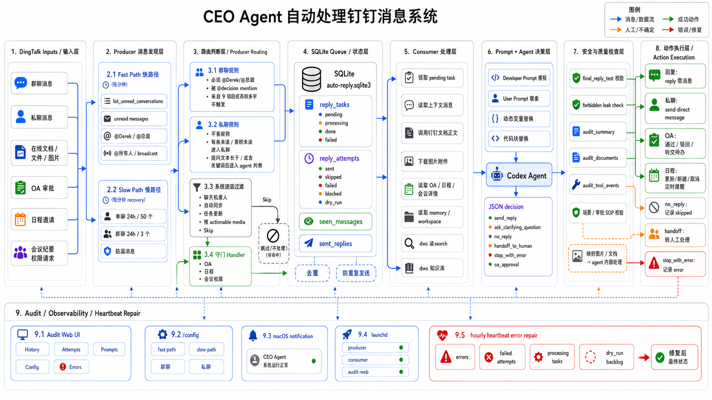

# CEO Agent Service

面向企业管理者的本地优先钉钉消息自动处理系统。

CEO Agent Service 会从钉钉读取私聊、群聊、在线文档、OA 审批、日程邀请和会议权限请求，把需要判断的消息交给 Codex Agent 处理，并把每一次决策、证据、发送结果和错误状态写入本地 SQLite，方便审计、反馈和持续修复。

> 这个项目的目标不是替人“随便自动回复”，而是把企业 IM 中可结构化处理的信息流接入一个可审计、可回滚、可人工接管的本地 agent 工作流。



## 适用场景

- 管理者每天收到大量钉钉消息，需要区分真正需要本人判断的事项、普通同步、系统通知和可自动处理事项。
- 团队希望在不迁移到新聊天产品的前提下，把 AI assistant 接入现有钉钉工作流。
- 公司内部知识、审批材料、会议记录和候选人信息较敏感，希望检索、生成、审计状态尽量保留在本地机器。
- 自动化回复需要可追踪：为什么回复、依据了哪些文档、是否调用了工具、是否真的发送成功。

## 核心能力

- **钉钉消息发现**：通过 `dws` 读取未读会话、@ 消息、群聊广播消息，并用慢路径补扫防止漏消息。
- **消息路由**：区分群聊、私聊、文档、图片、日程、会议权限、OA 审批和系统通知。
- **本地任务队列**：使用 SQLite 保存 `reply_tasks`、`reply_attempts`、`seen_messages`、`sent_replies`，避免重复处理和重复发送。
- **Codex Agent 决策**：使用结构化 JSON 输出 `send_reply`、`ask_clarifying_question`、`no_reply`、`handoff_to_human`、`stop_with_error`、`oa_approval`。
- **文档和图片上下文**：读取钉钉在线文档、普通文件正文、图片附件和本地 workspace 资料后再交给 agent 判断。
- **安全和质量检查**：发送前检查 `final_reply_text`、敏感路径泄漏、审计摘要、审计文档、权限/SOP。
- **人工接管**：对需要本人处理的消息发送 handoff，并暂停该会话的自动回复直到检测到真人回复。
- **审计 Web UI**：本地 FastAPI 页面查看历史、attempt 详情、Codex session、错误、Prompt 模板和路由配置。
- **自动修复 heartbeat**：定期检查 failed/processing/dry_run backlog，修复后必须把受影响信息处理到最终状态。

## 系统架构

系统由九层组成：

1. **DingTalk Inputs**：群聊、私聊、在线文档、文件、图片、OA、日程、会议权限请求。
2. **Producer 消息发现层**：快路径每分钟看未读；慢路径每小时补扫近期单聊和群聊。
3. **Producer Routing 路由判断层**：群聊必须 @ 触发；私聊不需要 @；系统通知跳过；OA/日程/会议权限进入专门 handler。
4. **SQLite Queue 状态层**：保存待处理任务、处理尝试、已读消息、已发送回复。
5. **Consumer 处理层**：领取 pending task，读取上下文、钉钉文档、图片附件、OA/日程详情和本地 workspace。
6. **Prompt + Agent 决策层**：Developer Prompt、User Prompt、动态变量和 Codex Agent 共同生成结构化决策。
7. **安全与质量检查层**：检查回复文本、泄漏、审计字段、权限和 SOP。
8. **动作执行层**：群聊 reply 原消息、私聊 direct message、OA 通过/退回/评论、日程接受/追问/跳过。
9. **Audit / Observability / Heartbeat Repair**：审计页面、macOS 通知、launchd 进程和定时错误修复。

## 消息如何被处理

### 快路径

- Producer 每次运行调用 `list_unread_conversations(count=50)`。
- 对有新未读的会话读取 `read_unread_messages`。
- 同时读取配置中的本人 @ 别名、@所有人/@all 等 mention/broadcast 消息，避免未读状态不完整导致漏消息。
- 通过路由规则后写入 `reply_tasks`。

### 慢路径

- 每小时补扫近期会话。
- 单聊：最近 24 小时、最多 50 个本地记录过的单聊。
- 群聊：最近 24 小时、最多 3 个本地记录过的群聊。
- 慢路径仍然遵守群聊触发规则：没有 @ 本人或广播 alias 的群聊消息不会进入 agent。

### 群聊规则

- 群聊消息必须 @ 本人，或命中配置的 broadcast alias，才进入 producer 判断。
- 群聊里的普通文档分享如果没有 @ 本人，不会触发 agent。
- 连续来自同一发送人的候选消息会合并成一个 reply task，避免同一上下文被拆成多次回复。

### 私聊规则

- 私聊不需要 @ 本人。
- 私聊消息经过未读/慢路径选择和系统通知过滤后，最新一条 remaining message 会进入 agent 判断。
- 私聊里的钉钉在线文档卡片会进入 agent 判断，不会因为渲染成图片/链接卡片就直接 `no_reply`。

完整规则见 [docs/message-routing-rules.md](docs/message-routing-rules.md)。

## 安全边界

默认设计是“本地优先”：

- 钉钉认证、Codex session、SQLite 数据库、语料库和业务材料不应提交到 Git。
- 默认使用 `CEO_NOT_SEND_MESSAGE=1`，只记录决策不发送。
- live send 需要显式设置 `CEO_NOT_SEND_MESSAGE=0` 和 `CEO_LIVE_SEND_BLOCKERS_ACCEPTED=1`。
- 回复不得暴露本地文件路径、session id、token、cookie、签名 URL 或工具原始输出。
- OA 审批必须读取完整审批材料、流程节点、附件和 SOP；无法确定时评论追问或 handoff。

## 快速开始

### 1. 准备依赖

需要：

- Python 3.11+
- 已认证的 `dws` CLI
- 可运行 `codex exec` 的 Codex CLI
- 可选：本地知识 workspace 和 graphify 输出

### 2. 安装本地服务

```bash
python3 -m venv apps/local-service/.venv
apps/local-service/.venv/bin/pip install -e 'apps/local-service[dev]'
```

### 3. 配置环境变量

复制 `.env.example` 并按本机路径修改：

```bash
cp .env.example .env
```

常用配置：

| 变量 | 作用 |
| --- | --- |
| `CEO_WORKSPACE` | 本地知识 workspace，供 agent 检索 |
| `CEO_WORKER_DB` | SQLite 状态库路径 |
| `CEO_NOT_SEND_MESSAGE` | `1` 表示只记录不发送，`0` 表示允许发送 |
| `CEO_LIVE_SEND_BLOCKERS_ACCEPTED` | live send 的显式确认开关 |
| `CEO_CORPUS_DIR` | 本地风格语料目录 |
| `CEO_MENTION_ALIASES` | 群聊中触发本人的 @ 别名 |
| `CEO_ASSISTANT_SIGNATURE` | 自动回复签名 |
| `CEO_HANDOFF_ACK` | 交给真人时发送的确认文本 |

不要把 `HOME` 指向项目目录。`dws` 和 Codex 需要使用真实用户环境里的认证状态。

### 4. 运行一次 dry-run

```bash
cd apps/local-service
CEO_NOT_SEND_MESSAGE=1 .venv/bin/ceo-agent run-once --not-send-message
```

### 5. 启动审计页面

```bash
cd apps/local-service
.venv/bin/python -m ceo_agent_service.cli audit-web --reload --host 127.0.0.1 --port 8765
```

打开：

```text
http://127.0.0.1:8765/
```

常用页面：

- `/`：回复历史和待处理任务
- `/attempts/{id}`：单次处理详情
- `/codex`：本地 Codex session
- `/developer-prompt`：Developer/User Prompt 模板管理
- `/config`：快路径、慢路径、群聊、私聊路由说明
- `/errors`：错误列表

## 生产运行

本项目提供 macOS `launchd` 模板：

```bash
scripts/install-auto-reply-agents.sh
```

安装前请先检查 `launchd/*.plist` 中的本地路径、用户名、workspace、数据库路径和 persona 配置。开源部署时通常需要替换这些值。

运行模型：

- `reply-producer`：每分钟运行一次 `produce-once`，只负责发现消息和入队。
- `reply-consumer`：常驻运行 `consume`，逐个领取任务、调用 agent、执行发送或跳过。
- `audit-web`：本地审计页面。

手动发送已审阅 attempt：

```bash
cd apps/local-service
CEO_NOT_SEND_MESSAGE=0 CEO_LIVE_SEND_BLOCKERS_ACCEPTED=1 \
  .venv/bin/ceo-agent send-attempt --attempt-id 123
```

重跑指定消息：

```bash
cd apps/local-service
.venv/bin/ceo-agent rerun-message \
  --conversation-id '<openConversationId>' \
  --message-id '<openMessageId>' \
  --force-new-decision
```

## 风格语料和工作画像

可从本地会议纪要和已发送钉钉消息构建风格语料：

```bash
cd apps/local-service
.venv/bin/ceo-agent build-corpus \
  --workspace /path/to/workspace \
  --corpus-dir /path/to/corpus
```

追加当前 `dws` 用户的近期钉钉发送样例：

```bash
cd apps/local-service
.venv/bin/ceo-agent collect-corpus \
  --workspace /path/to/workspace \
  --corpus-dir /path/to/corpus
```

工作画像生成流程见 [docs/work-profile-distillation-tutorial.md](docs/work-profile-distillation-tutorial.md)。

## 项目结构

```text
.
├── apps/local-service/          # Python 服务、CLI、worker、测试
├── docs/                        # 架构图、DWS 能力、消息路由和产品逻辑文档
├── launchd/                     # macOS launchd 模板
├── prompts/                     # Developer/User Prompt 模板
├── corpus/                      # 本地风格语料目录，部署时不应提交真实数据
├── data/                        # SQLite 和运行态数据，部署时不应提交真实数据
└── scripts/                     # 安装和运行辅助脚本
```

## 开发和测试

运行测试：

```bash
cd apps/local-service
.venv/bin/pytest -q
```

只跑相关测试：

```bash
cd apps/local-service
.venv/bin/python -m pytest tests/test_worker.py -q
```

Live smoke tests 默认跳过，只有显式设置环境变量时才会访问真实钉钉或发送外部可见消息。

## 文档

- [docs/product-logic.md](docs/product-logic.md)：产品逻辑、审计、安全默认值。
- [docs/message-routing-rules.md](docs/message-routing-rules.md)：消息类型、路由条件和已实现规则。
- [docs/dws-capabilities.md](docs/dws-capabilities.md)：项目使用的 DWS 能力。
- [docs/work-profile-distillation-tutorial.md](docs/work-profile-distillation-tutorial.md)：工作画像生成教程。
- [SECURITY.md](SECURITY.md)：安全策略。
- [CONTRIBUTING.md](CONTRIBUTING.md)：贡献指南。

## 开源部署提醒

这个仓库可以开源代码和通用模板，但真实部署时请确认：

- 没有提交真实 SQLite、日志、Codex session、语料 CSV、工作画像或钉钉导出材料。
- `.env`、keychain、token、cookie、DingTalk 机器人 code 不进入仓库。
- `launchd` 模板中的个人路径和 persona 已替换。
- README 中的架构图不包含敏感公司信息。

## License

MIT
