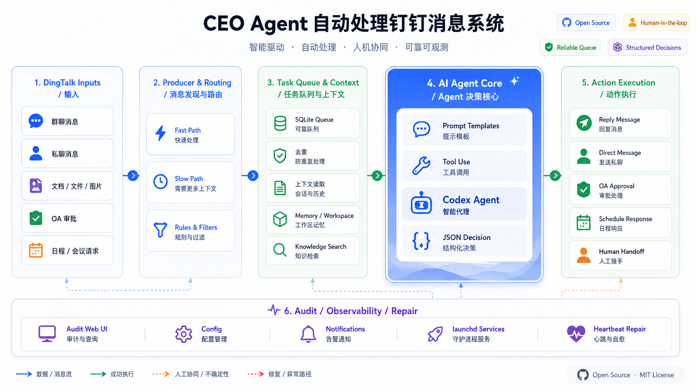

# CEO Agent Service

面向企业管理者的本地优先钉钉消息自动处理系统。

CEO Agent Service 会从钉钉读取私聊、群聊、在线文档、OA 审批、日程邀请和会议权限请求，把需要判断的消息交给 Codex Agent 处理，并把每一次决策、证据、发送结果和错误状态写入本地 SQLite，方便审计、反馈和持续修复。

> 这个项目的目标不是替人“随便自动回复”，而是把企业 IM 中可结构化处理的信息流接入一个可审计、可回滚、可人工接管的本地 agent 工作流。



## 适用场景

- 管理者每天收到大量钉钉消息，需要区分真正需要本人判断的事项、普通同步、系统通知和可自动处理事项。
- 团队希望在不迁移到新聊天产品的前提下，把 AI assistant 接入现有钉钉工作流。
- 公司内部知识、审批材料、会议记录和候选人信息较敏感，希望检索、生成、审计状态尽量保留在本地机器。
- 自动化回复需要可追踪：为什么回复、依据了哪些文档、是否调用了工具、是否真的发送成功。

## 核心能力

- **钉钉消息发现**：通过 `dws` 读取未读会话、@ 消息、群聊广播消息、配置机器人私聊消息，并用慢路径补扫防止漏消息。
- **消息路由**：区分群聊、私聊、文档、图片、日程、会议权限、OA 审批和系统通知。
- **本地任务队列**：使用 SQLite 保存 `reply_tasks`、`reply_attempts`、`seen_messages`、`sent_replies`，避免重复处理和重复发送。
- **Codex Agent 决策**：使用结构化 JSON 输出 `send_reply`、`ask_clarifying_question`、`no_reply`、`handoff_to_human`、`stop_with_error`、`oa_approval`。
- **CEO 画像数据准备**：从本地工作文档、AI 听记、历史发送样例和可读钉钉知识库中提取证据，蒸馏生成 `data/work-profile/work_profile.md`；运行时只通过 `work_profile_instruction()` 消费这个结果，让 agent 学习管理者的判断顺序、追问方式、表达风格和硬边界。
- **文档和图片上下文**：读取钉钉在线文档、普通文件正文、图片附件和本地 workspace 资料后再交给 agent 判断。
- **安全和质量检查**：发送前检查 `final_reply_text`、敏感路径泄漏、审计摘要、审计文档、权限/SOP。
- **人工接管**：对需要本人处理的消息发送 handoff，并暂停该会话的自动回复直到检测到真人回复。
- **Task 总结**：从已处理对话、AI 听记和 `CEO_WORKSPACE` 新增文件里抽取公司管理事项、业务项目和重要 TODO，归档到 work project 并生成下一步和跟进草稿。
- **会后对齐 Agent**：发现 Derek 参会且已结束至少十分钟的会议；仅在存在观点分歧或需要输出 Derek 观点解读时，自动发到最匹配的群，1:1 会议才私聊，并默认只真实 @ 参会相关人；非参会人只有会议中明确说到是他的任务时才 @。
- **审计 Web UI**：本地 FastAPI 页面查看历史、attempt 详情、Codex session、错误、Prompt 模板和路由配置。
- **自动修复 heartbeat**：定期检查 failed/processing/dry_run backlog，修复后必须把受影响信息处理到最终状态。

## 系统架构

系统由九层组成：

1. **DingTalk Inputs**：群聊、私聊、配置机器人私聊、在线文档、文件、图片、OA、日程、会议权限请求。
2. **Producer 消息发现层**：快路径每分钟看未读；慢路径每小时补扫近期单聊和群聊。
3. **Producer Routing 路由判断层**：群聊必须 @ 触发；私聊不需要 @；系统通知跳过；OA/日程/会议权限进入专门 handler。
4. **SQLite Queue 状态层**：保存待处理任务、处理尝试、已读消息、已发送回复。
5. **Consumer 处理层**：领取 pending task，读取上下文、钉钉文档、图片附件、OA/日程详情和本地 workspace。
6. **Prompt + Agent 决策层**：Developer Prompt、User Prompt、动态变量和 Codex Agent 共同生成结构化决策。
7. **安全与质量检查层**：检查回复文本、泄漏、审计字段、权限和 SOP。
8. **动作执行层**：群聊 reply 原消息、私聊 direct message、OA 通过/拒绝、OA 退回建议转审批单留言、日程接受/追问/跳过；OA 退回建议不会用拒绝冒充执行。
9. **Audit / Observability / Heartbeat Repair**：审计页面、macOS 通知、launchd 进程和定时错误修复。

当回复判断依赖 DWS 材料时，`codex exec` 内的只读 DWS 命令统一使用 900 秒 HTTP 超时。若 DWS 读取仍以临时网络错误失败，且本轮没有记录其他可用材料，决策会被强制转换为 `blocked`，原 reply task 按指数退避重试；服务不会把材料读取失败改写成拒绝、追问或无依据回复。

## 消息如何被处理

### 快路径

- Producer 每次运行调用 `list_unread_conversations(count=50)`。
- 对有新未读的会话读取 `read_unread_messages`。
- 同时读取配置中的本人 @ 别名、@所有人/@all 等 mention/broadcast 消息，避免未读状态不完整导致漏消息。
- 同时读取 `CEO_CHAT_BOT_NAMES` 或 `CEO_DING_ROBOT_NAME` 对应的机器人单聊，真人发给机器人的消息会进入 agent，并通过机器人账号回复。
- 通过路由规则后写入 `reply_tasks`。

### 慢路径

- 每小时补扫近期会话。
- 单聊：最近 24 小时、最多 50 个本地记录过的单聊。
- 群聊：最近 24 小时、最多 3 个本地记录过的群聊。
- 慢路径仍然遵守群聊触发规则：没有 @ 本人或广播 alias 的群聊消息不会进入 agent。

### 群聊规则

- 群聊消息必须 @ 本人，或命中配置的 broadcast alias，才进入 producer 判断。
- 群聊里的普通文档分享如果没有 @ 本人，不会触发 agent。
- 连续来自同一发送人的候选消息会合并成一个 reply task，避免同一上下文被拆成多次回复。

### 私聊规则

- 私聊不需要 @ 本人。
- 私聊消息经过未读/慢路径选择和系统通知过滤后，最新一条 remaining message 会进入 agent 判断。
- 私聊里的钉钉在线文档卡片会进入 agent 判断，不会因为渲染成图片/链接卡片就直接 `no_reply`。

完整规则见 [docs/message-routing-rules.md](docs/message-routing-rules.md)。

## 安全边界

默认设计是“本地优先”：

- 钉钉认证、Codex session、SQLite 数据库、语料库和业务材料不应提交到 Git。
- 默认使用 `CEO_NOT_SEND_MESSAGE=0` 正常处理消息和日历动作。
- dry-run 需要显式设置 `CEO_NOT_SEND_MESSAGE=1` 或使用 `--not-send-message` / `--dry-run`，只记录决策不发送。
- live send 仍需要 `CEO_LIVE_SEND_BLOCKERS_ACCEPTED=1` 作为显式确认开关。
- 回复不得暴露本地文件路径、session id、token、cookie、签名 URL 或工具原始输出。
- OA 审批必须读取完整审批材料、流程节点、附件和 SOP；无法确定时评论追问或 handoff。

## OKR 审核数据源

OKR 审核 runner 默认使用叮当 OKR Web live source，不再依赖本地 xlsx/raw JSON，也不会默认把叮当 OKR
误当成 Agoal 规则接口。

- `CEO_OKR_SOURCE_KIND=dingteam_web` 时，必须设置 `CEO_OKR_LIVE_SOURCE_COMMAND`。该命令接收
  `{user_id}` 和 `{period_label}` 占位符，并返回 worker 可用的实时 OKR JSON。
  本机 Dingteam Web source 命令示例：
  `CEO_OKR_LIVE_SOURCE_COMMAND=/Users/derek/Documents/Projects/ceo-agent-service/scripts/dingteam_okr_live_source.py --user-id {user_id} --period-label {period_label}`。
  该命令要求 Chrome 已登录 `dingokr.dingteam.com`，Chrome 会正常保存登录 cookie；脚本只通过页面内
  API 拉取数据，不导出或复制浏览器 cookie、localStorage 或 session 文件。若 DingTeam 返回未登录，
  脚本会把 DingTeam tab 切到前台并发本机通知，提醒 Derek 在 Chrome 中完成登录。
- 只有确认企业 OKR 数据暴露在 Agoal objective API 中时，才设置 `CEO_OKR_SOURCE_KIND=agoal`。
- Agoal 模式从 `~/.dingtalk-skills/config` 或 `.env` 读取应用凭证；如果规则列表为空或不唯一，
  设置 `CEO_OKR_OBJECTIVE_RULE_ID`，否则服务会直接报错。
- 实时 API 获取失败时，服务会记录 history 并回复“现在无法获取实时 OKR 数据”，不会静默改用历史导出文件。

## Agent 安装入口

推荐由 Codex 或其他本机 agent 按
[docs/agent-installation-runbook.md](docs/agent-installation-runbook.md) 执行安装。该 runbook 覆盖组件下载和校验
（`dws`、Codex CLI、Memory Connector、Nvwa skill）、交互式参数收集、`.env` 配置、数据 corpus 准备、
工作画像生成、审计 Web UI、launchd 常驻服务和权限检查。

组件准备优先由 agent 自动执行：

```bash
scripts/bootstrap-local-components.sh --format json
```

该脚本会自动安装 `terminal-notifier`、检查并升级已安装的 `dws`，并检查 Codex CLI 与 Nvwa skill。
如果新机器缺少内部组件来源，先通过 `DWS_INSTALLER_PATH` / `DWS_INSTALL_COMMAND`、
`CODEX_INSTALL_COMMAND`、`NVWA_SKILL_SOURCE` 提供组织批准的安装入口，再由 agent 继续执行，不要求用户逐条复制命令。

不要让使用者逐条复制终端命令完成安装。agent 应该自己执行命令、检查输出、编辑本机配置，只在需要用户完成
登录授权、扫码确认、macOS 权限点击、安装来源确认或 live-send 决策时打断用户。

下面的快速开始保留为 agent 执行和调试参考；新机器首次安装应优先使用 agent runbook。

## 快速开始

### 1. 准备依赖

需要：

- Python 3.11+
- 已认证的 `dws` CLI
- 可运行 `codex exec` 的 Codex CLI
- 可选：已认证的 `lark-cli`，用于读取飞书文档材料
- 可选：Codex `exa` MCP 配置，用于需要外部检索的回复判断
- 可选：本地知识 workspace 和 graphify 输出

### 2. 安装本地服务

```bash
python3 -m venv .venv
.venv/bin/pip install -e '.[dev]'
```

### 3. 配置环境变量

复制 `.env.example` 并按本机路径修改：

```bash
cp .env.example .env
```

常用配置：

| 变量 | 作用 |
| --- | --- |
| `CEO_WORKSPACE` | 本地知识 workspace，供 agent 检索 |
| `CEO_WORKER_DB` | SQLite 状态库路径 |
| `CEO_NOT_SEND_MESSAGE` | `1` 表示只记录不发送，`0` 表示允许发送 |
| `CEO_LIVE_SEND_BLOCKERS_ACCEPTED` | live send 的显式确认开关 |
| `CEO_CORPUS_DIR` | 本地风格语料目录 |
| `CEO_MEETING_PRODUCER_INTERVAL_SECONDS` | 会议信息发现周期，默认 60 秒 |
| `CEO_MEETING_CONSUMER_POLL_INTERVAL_SECONDS` | 会后对齐队列消费周期，默认 10 秒 |
| `CEO_MEETING_SETTLE_SECONDS` | 明确会议结束后的静默等待时间，默认 600 秒 |
| `CEO_CODEX_MODEL` / `CEO_CODEX_MODEL_PROVIDER` | 可选的显式模型和 provider；默认留空，使用原生 `codex exec` 登录态和默认配置 |
| `CEO_CODEX_PASSTHROUGH_MCP_SERVERS` | `--ignore-user-config` 下仍允许透传的 MCP 白名单；默认保留 `xiaoqing_interview,exa`。`memory_connector` 单独注入；飞书走 `lark-cli`，不是默认 MCP |
| `CEO_MENTION_ALIASES` | 群聊中触发本人的 @ 别名 |
| `CEO_DING_ROBOT_NAME` | handoff/DING 通知使用的机器人名称；默认服务启动配置为 `磊哥`，运行时解析 robot code |
| `CEO_CHAT_BOT_NAMES` | 允许触发自动回复的机器人名称列表，默认复用 `CEO_DING_ROBOT_NAME` |
| `CEO_ROBOT_DIRECT_MESSAGE_LOOKBACK` | 机器人私聊轮询窗口，默认 `4h` |
| `CEO_ASSISTANT_SIGNATURE` | 自动回复签名 |
| `CEO_HANDOFF_ACK` | 交给真人时发送的确认文本 |
| `CEO_FEEDBACK_SPIKE_VERCEL_BASE_URL` | 可选的对话方反馈页根地址；留空则不追加反馈链接。启用前必须把本仓库的 Vercel API 路由部署到安装者自己的 Vercel 项目，并填写自己的部署根地址；不要复用其他人的反馈服务 URL。配置后会在发出的回复末尾追加 `👍 赞｜👎 踩` 反馈链接；同一会话长期未评价时会升级为强提醒，超过硬阈值后只回复“请对我提供反馈后再提问” |

不要把 `HOME` 指向项目目录。`dws` 和 Codex 需要使用真实用户环境里的认证状态。

#### 可选：部署反馈链接服务

反馈链接不是公共服务，也没有仓库内置的默认域名。每个安装者如果要启用反馈链接，需要自己部署一套：

1. 在 Vercel 新建项目，源码指向本仓库或只部署 `api/dingtalk-feedback-spike*.js` 和 `api/feedback-storage.js` 相关路由。
2. 在 Vercel 项目里配置 `FEEDBACK_SPIKE_SECRET`，用于保护反馈事件查询接口。
3. 如果使用 Vercel Blob 存反馈事件，按 Vercel 的要求给该项目配置 Blob 存储环境变量。
4. 部署成功后，把该项目的根地址写入本机 `.env` 的 `CEO_FEEDBACK_SPIKE_VERCEL_BASE_URL`，例如 `https://your-feedback-service.vercel.app`。

不要把个人 `.vercel/` 项目绑定、部署 secret、Blob token 或某个安装者的真实 Vercel 域名提交到仓库。`.vercel/` 已在 `.gitignore` 中；`.env.example` 也默认留空，因此未配置时服务不会追加反馈链接。

### 4. 准备知识库

CEO Agent Service 会把“知识库”分成两类：本地知识库和外部可访问知识库。本地知识库由 `CEO_WORKSPACE` 指向；外部知识库通过 `dws`、Codex MCP 工具或当前消息材料按权限读取。

#### 本地知识库

建议把本地知识库放在项目目录之外，例如：

```text
/path/to/workspace/
├── AI听记/                    # 会议纪要、逐字稿、AI 总结
├── management/
│   ├── OA/                    # 审批原则、日历规则、SOP
│   └── strategy/              # 战略、组织、产品判断材料
├── recruiting/                # JD、岗位画像、简历和面试记录
├── Thinking/                  # 个人或团队沉淀文档
└── graphify-out/
    └── GRAPH_REPORT.md        # 可选：graphify 生成的结构化索引
```

准备步骤：

1. 把可检索的业务材料整理到 `CEO_WORKSPACE`，优先使用 Markdown、文本、可读的导出文档或已抽取正文的文件。
2. 在 `.env` 里设置 `CEO_WORKSPACE=/path/to/workspace`。
3. 对需要稳定执行的规则，放到明确路径，例如 `management/OA/审批原则.md`、`management/OA/日历规则.md`。
4. 可选运行 graphify，让 agent 先读 `graphify-out/GRAPH_REPORT.md`，再用本地文件验证具体事实。
5. 不要把真实知识库、会议记录、简历、审批材料放进 Git；这些内容应该留在本地 workspace 或被 Git 忽略的运行目录。

运行时，agent 会按 Prompt 规则先判断是否需要背景信息；需要时优先检索本地文件，再使用外部知识入口。回复正文不会暴露本地路径、检索命令、工具输出或内部审计细节。

#### 外部可访问知识库

外部知识入口取决于当前机器的认证和工具安装情况：

| 知识入口 | 能读什么 | 主要用途 | 边界 |
| --- | --- | --- | --- |
| 钉钉在线文档 / 知识库 | `dws doc info/read/list/search` 可访问的 Alidocs 文档、文件夹和知识库节点 | 读取消息里贴出的文档、构建工作画像、审阅材料 | 只读优先；访问范围由当前 `dws` 登录用户权限决定 |
| 钉钉 AI 表格 | `dws aitable` 可访问的 AI 表格、表、记录和附件信息 | 当链接类型是 AI 表格时读取结构化数据 | 不能当普通在线文档读；需要按表结构读取 |
| 钉钉普通文件 / 钉盘 | `dws doc` / `dws drive` 能定位或下载的普通文件 | 读取附件、简历、方案、审批材料 | 只有文件名不等于有正文；拿不到正文时不能凭文件名判断 |
| DWS 企业搜索 | `dws aisearch` 可访问的人员、知识、行为、群组和帮助中心搜索 | 本地资料不足时补查企业内知识、历史上下文或组织信息 | 搜索结果仍需可读材料验证，不能只凭标题下结论 |
| 钉钉会话上下文 | `dws chat` 可读的群聊、私聊、引用消息和历史消息 | 理解当前 trigger、前后文、是否已经有人处理 | 群聊仍必须满足路由规则才进入 agent |
| OA / 日程 / 联系人 | `dws oa`、`dws calendar`、`dws contact` 可读的审批、日程、组织信息 | 审批审阅、日程判断、识别本人和相关人员 | 审批动作必须满足 SOP 和材料完整性要求 |
| Memory Connector MCP | `memory_recall`、`memory_write`、`document_upload` 可访问的长期记忆 | 回忆历史决策、过往偏好、上次处理结果，并在回复后写入 episode | 不是替代业务文档的事实来源；关键判断仍要回到材料和上下文 |

钉钉知识库准备建议：

```bash
dws auth status
dws doctor --json --timeout 5
dws doc info --node '<alidocs-url>' --format json
dws doc read --node '<alidocs-url>' --format json
```

如果要把某个钉钉知识库纳入工作画像构建，可以使用知识库 ID 或知识库 URL：

```bash
cd /path/to/ceo-agent-service
.venv/bin/ceo-agent build-work-profile \
  --workspace /path/to/workspace \
  --corpus-dir /path/to/data/corpus \
  --dingtalk-kb-workspace '<workspace-id-or-url>'
```

普通运行时不需要预先同步整个外部知识库。消息中出现钉钉在线文档、OA、日程、图片或文件材料时，worker 会先尽量读取可访问正文和附件，再把材料区块交给 agent。读不到关键材料时，应追问、评论要求补材料或返回可审计错误，而不是猜测。

### 5. 数据准备：CEO 人格蒸馏

CEO Agent 不是只靠通用 prompt 模仿语气。人格蒸馏属于运行前的数据准备环节：服务会把可审计的工作证据蒸馏成一个 repo-local profile，供后续运行时读取。

1. `build-corpus` 从本地 AI 听记和会议资料生成风格语料。
2. `collect-corpus` 追加当前 `dws` 用户近期已发送的钉钉消息样例。
3. `build-work-profile` 汇总 `style_corpus.csv`、`CEO_WORKSPACE` 中的本地工作文档、以及 `dws` 可读的钉钉知识库文档，写入 `data/profile-evidence/evidence_index.jsonl`，并生成初版 `data/work-profile/work_profile.md`。
4. Nvwa persona skill 只在数据准备/复核阶段使用：读取 evidence index、style corpus 和初版 profile，重写 `data/work-profile/work_profile.md`，把大量具体证据压缩成稳定的心智模型、决策启发式、表达 DNA、价值观/反模式、核心张力和场景硬规则。
5. 运行时不加载 Nvwa，也不读取原始证据。`work_profile_instruction()` 只读取数据准备产物 `data/work-profile/work_profile.md`，把它注入 agent prompt，并明确要求 agent 不复述证据 id、本地路径或蒸馏过程。

这个 profile 不能覆盖硬规则：现实动作仍必须 handoff，审批/OA 必须看完整材料，人事敏感问题要谨慎，候选人判断必须看岗位和简历证据，回复正文不得暴露本地路径或工具细节。

更详细流程见 [docs/nvwa-work-profile-installation.md](docs/nvwa-work-profile-installation.md)；
逐步生成与每阶段是否满足的 checker 见
[docs/work-profile-distillation-tutorial.md](docs/work-profile-distillation-tutorial.md)。

### 6. 运行一次 dry-run

```bash
cd /path/to/ceo-agent-service
CEO_NOT_SEND_MESSAGE=1 .venv/bin/ceo-agent run-once --not-send-message
```

### 7. 启动审计页面

```bash
cd /path/to/ceo-agent-service
.venv/bin/python -m app.cli audit-web --reload --host 127.0.0.1 --port 8765
```

打开：

```text
http://127.0.0.1:8765/
```

常用页面：

- `/`：回复历史和待处理任务
- `/tasks`：work projects、状态、category filter、Priority/Risk 排序、TODO checklist、实时全文检索和分页
- `/tasks/{project_id}`：单个 work project 详情、facts、TODO DDL/owner、更新记录和 follow-up 记录
- `/attempts/{id}`：单次处理详情
- `/codex`：本地 Codex session
- `/developer-prompt`：Developer/User Prompt 模板管理
- `/config`：快路径、慢路径、群聊、私聊路由说明
- `/errors`：错误列表

### 7. 启用 task 总结

Task 总结以项目为主线记录管理事项、产研事项、业务项目和其他重要事项。每条新处理对话会生成一个结构化 Work Item，task agent 再结合 BM25 候选、DWS 上下文和 Memory Connector 判断是更新现有项目还是新增项目。

核心字段：

- `work_projects`：项目标题、分类、背景、owner、优先级、状态、下一步、事实列表。
- `work_todos`：归属项目、owner、优先级、due time、状态和来源。
- `work_updates`：每次 task agent 对项目/TODO 的更新说明、来源和后续动作。
- `follow_up_drafts`：到期后需要在群里或私信询问 owner 的消息草稿和发送状态。
- `work_todo_dingtalk_links`：内部 TODO 和钉钉 Todo 的同步状态、外部 task id、最近 pull/push 时间和错误信息。

Task 分类包括：

```text
management, strategy, projects, marketing, research, dev, product,
recruiting, sales, finance, admin, HR, other
```

主服务会自动运行 task maintenance：

- 每 `CEO_TASK_WORK_ITEM_INTERVAL_SECONDS` 秒消费一次 reply worker 写入的 Work Item，默认 60 秒。
- 每 `CEO_TASK_DAILY_INTERVAL_SECONDS` 秒扫描 AI 听记、本地新增文件、拉取钉钉 Todo 完成状态并处理到期 follow-up，默认 86400 秒。

钉钉 Todo 是 owner 执行层，不替代 `/tasks` 里的内部项目管理视图。只有明确 owner、due time、非敏感且未完成的高置信 TODO 会创建钉钉 Todo；Derek 默认不作为执行人加入。内部 `work_todos` 仍是主数据，钉钉 Todo 只同步创建、完成状态拉取和有强证据时的完成推送。发送 follow-up 前会先检查已关联的钉钉 Todo 状态：如果钉钉侧已经完成，系统会关闭内部 TODO 并跳过提醒，避免重复催办。

可见性：

- `/tasks/{project_id}` 的每个 TODO 下会显示钉钉 Todo 的 task id、状态、最近 pull/push 时间和错误。
- `/logs` 会显示 `DingTalk Todo` 类别的创建、拉取和完成同步记录。
- `daily-task-maintenance` 输出包含 `dingtalk_todos_closed`，表示本次从钉钉 Todo 拉取后关闭的内部 TODO 数量。

手动补跑命令：

```bash
cd /path/to/ceo-agent-service

# 处理 reply worker 已写入的 Work Item
.venv/bin/ceo-agent process-work-items --max-batches 20

# 扫描新增 AI 听记和 CEO_WORKSPACE 下的新增 Markdown/text 文件
.venv/bin/ceo-agent scan-task-sources

# 扫描、处理 Work Item、处理到期 follow-up
CEO_NOT_SEND_MESSAGE=1 .venv/bin/ceo-agent daily-task-maintenance --not-send-message
```

`scan-task-sources` 的本地文件扫描只读取 `CEO_WORKSPACE` 指定路径，不会全盘扫描。AI 听记通过当前 `dws` 登录态增量读取。

如果 Codex 或 Claude Desktop 没有配置 Memory Connector，可以先检查/写入本机配置：

```bash
.venv/bin/ceo-agent setup-memory-connector \
  --memory-url 'https://memory.example.com/mcp/'
```

Codex 配置会写入 `[mcp_servers.memory_connector]`，并使用现有 OAuth Authorization 作为身份。Claude Desktop 的 remote MCP 需要在 Settings > Connectors 手动添加；命令只报告状态，不直接改写 remote connector。

CEO reply agent 默认继续使用 `--ignore-user-config` 隔离个人 hooks、plugins 和 profiles。需要保留给 agent 的外部能力分两类：

- CLI 能力：`dws` 和 `lark-cli` 由服务环境直接提供。DWS 负责钉钉消息、文档、审批、日历、通讯录和 AI 听记；`lark-cli` 负责飞书文档读取。两者都不通过 MCP 透传。
- MCP 能力：`memory_connector` 由服务专门注入；`xiaoqing_interview` 和 `exa` 从 `~/.codex/config.toml` 的同名 `[mcp_servers.*]` 读取安全连接字段后透传。若安装者没有配置 `[mcp_servers.exa]`，Exa 能力不会生效，但也不会阻止服务启动。

为了避免把个人密钥写进进程命令行，MCP 透传只复制 URL、OAuth resource、command、args、startup timeout 和 bearer token 环境变量名，不复制 `[mcp_servers.*.env]` 里的密钥值。需要 API key 的 stdio MCP 应把密钥放在 launchd 或 shell 环境中。

Follow-up 发送仍遵守 live-send 安全边界：默认 dry-run 时只生成/记录草稿；真实发送需要 `CEO_NOT_SEND_MESSAGE=0` 且显式设置 `CEO_LIVE_SEND_BLOCKERS_ACCEPTED=1`。

## 生产运行

本项目提供 macOS `launchd` 模板：

```bash
scripts/install-auto-reply-agents.sh
```

安装前请先检查 `launchd/*.plist` 中的本地路径、用户名、workspace、数据库路径和 persona 配置。开源部署时通常需要替换这些值。

运行模型只有一个 launchd job、五个内部组件；不会创建 meeting crontab 或第二个 plist：

- `com.ceo-agent-service.main`：唯一的 launchd 主服务。
- producer loop：按 `CEO_PRODUCER_INTERVAL_SECONDS` 间隔发现消息并入队，默认 60 秒。
- consumer loop：按 `CEO_CONSUMER_POLL_INTERVAL_SECONDS` 间隔领取任务、调用 agent、执行发送或跳过，默认 10 秒。
- meeting producer loop：读取 AI 听记与日历参会证据，只为 Derek 参会且明确结束至少 `CEO_MEETING_SETTLE_SECONDS` 的会议建队列；没有匹配日程的临时通话，仅在完整转写恰好证明 Derek 和另一位唯一员工时按 1:1 放行；没有触发条件的会议保持安静。
- meeting consumer loop：独立分析、选择最高分可发送群并投递；多方会议绝不降级私聊，1:1 才私聊另一位参会人。发送正文固定以 `【会议跟进】会议标题（会议时间）` 开头，便于收件人识别来源会议；真实 @ 默认限于参会人，非参会人只有会议转写明确说到是他的任务、由他负责、交给他确认或跟进时才 @。确认发送成功后复用 reply agent 的本地/Chrome notification 和钉钉会话点击跳转。dry-run 只分析到 `ready_to_send`，不会 claim 发送。
- task maintenance loop：按 `CEO_TASK_WORK_ITEM_INTERVAL_SECONDS` 处理 Work Item，并按 `CEO_TASK_DAILY_INTERVAL_SECONDS` 扫描 AI 听记、`CEO_WORKSPACE` 文件和到期 follow-up。

这些周期参数统一在审计页 `Config → System Config` 中维护，保存到 `.env` 后由 Python 服务启动时读取；launchd 模板不再在 shell 命令里写死或覆盖这些周期值。

meeting producer 首次启用时会持久化激活时间。服务启动恢复队列前，会把激活时间以前且从未尝试发送的历史任务统一标记为 `no_action`；因此切换瞬间已被旧进程领取的历史会议也不会在重启后重新进入分析或发送。

实际时长小于 10 分钟的听记在日历匹配和建队列前跳过；实际候选人面试由 agent 根据标题、摘要、参会人和完整转写识别并终止为 `no_action`。招聘站会、招聘计划、人才讨论和招聘需求对齐仍按普通业务会议处理。

会后队列状态为 `waiting → pending → processing → no_action | ready_to_send → sent`；可重试错误进入 `retry` 并带 `available_at`，Codex 结构化输出或历史来源协议偶发不合格也会先按可重试错误处理，达到上限后才隔离。发送结果不确定但有 `openTaskId` 时只核验状态，不重复发送；notification 只在最终确认 `sent` 时弹出一次。meeting run 和 reply attempt 共用 History 时间线、搜索、状态过滤、24 小时事件图和 Codex session 详情。

本地 dry-run 验证：

```bash
CEO_NOT_SEND_MESSAGE=1 .venv/bin/python -m app.cli service \
  --host 127.0.0.1 --port 8765
```

上线前可检查 SQLite：

```sql
select status, count(*) from meeting_alignment_jobs group by status;
select id, job_id, status, codex_session_id, created_at
from meeting_alignment_runs order by id desc limit 20;
```

受控回放最近 N 条听记（会重开其中未发送的历史 `no_action`，但不会重开 `sent`）：

```bash
CEO_NOT_SEND_MESSAGE=0 CEO_LIVE_SEND_BLOCKERS_ACCEPTED=1 \
  .venv/bin/ceo-agent replay-recent-meetings --limit 10
```

可用 `--offset` 跳过已完成的小批量窗口，例如先跑 `--limit 1`，确认后再跑 `--limit 9 --offset 1`，两次合计覆盖最新 10 条且不重复。

手动发送已审阅 attempt：

```bash
cd /path/to/ceo-agent-service
CEO_NOT_SEND_MESSAGE=0 CEO_LIVE_SEND_BLOCKERS_ACCEPTED=1 \
  .venv/bin/ceo-agent send-attempt --attempt-id 123
```

重跑指定消息：

```bash
cd /path/to/ceo-agent-service
.venv/bin/ceo-agent rerun-message \
  --conversation-id '<openConversationId>' \
  --message-id '<openMessageId>' \
  --force-new-decision
```

## 风格语料和工作画像

可从本地会议纪要和已发送钉钉消息构建风格语料：

```bash
cd /path/to/ceo-agent-service
.venv/bin/ceo-agent build-corpus \
  --workspace /path/to/workspace \
  --corpus-dir /path/to/data/corpus
```

追加当前 `dws` 用户的近期钉钉发送样例：

```bash
cd /path/to/ceo-agent-service
.venv/bin/ceo-agent collect-corpus \
  --workspace /path/to/workspace \
  --corpus-dir /path/to/data/corpus
```

工作画像生成依赖本地 Nvwa persona skill 做证据归纳和人工复核。安装与数据准备见
[docs/nvwa-work-profile-installation.md](docs/nvwa-work-profile-installation.md)，生成流程见
[docs/work-profile-distillation-tutorial.md](docs/work-profile-distillation-tutorial.md)，其中包含每阶段 checker。

## 项目结构

```text
.
├── app/                         # Python 应用包、CLI、worker 和资源
├── tests/                       # Python 测试
├── docs/                        # 架构图、DWS 能力、消息路由和产品逻辑文档
├── launchd/                     # macOS launchd 模板
├── app/defaults/                # 首次运行会复制到 data/ 的默认 Prompt 模板
├── data/                        # SQLite、Prompt override、corpus、profile 等本地运行态数据
└── scripts/                     # 安装和运行辅助脚本
```

## 开发和测试

运行测试：

```bash
cd /path/to/ceo-agent-service
.venv/bin/pytest -q
```

只跑相关测试：

```bash
cd /path/to/ceo-agent-service
.venv/bin/python -m pytest tests/test_worker.py -q
```

Live smoke tests 默认跳过，只有显式设置环境变量时才会访问真实钉钉或发送外部可见消息。

## 文档

- [docs/agent-installation-runbook.md](docs/agent-installation-runbook.md)：给 agent 执行的端到端安装流程。
- [docs/product-logic.md](docs/product-logic.md)：产品逻辑、审计、安全默认值。
- [docs/message-routing-rules.md](docs/message-routing-rules.md)：消息类型、路由条件和已实现规则。
- [docs/dws-capabilities.md](docs/dws-capabilities.md)：项目使用的 DWS 能力。
- [docs/dws-command-inventory.md](docs/dws-command-inventory.md)：本机 `dws` CLI 能力清单和安全边界。
- [docs/work-profile-distillation-tutorial.md](docs/work-profile-distillation-tutorial.md)：工作画像生成教程。
- [SECURITY.md](SECURITY.md)：安全策略。
- [CONTRIBUTING.md](CONTRIBUTING.md)：贡献指南。

## 开源部署提醒

这个仓库可以开源代码和通用模板，但真实部署时请确认：

- 没有提交真实 SQLite、日志、Codex session、语料 CSV、工作画像或钉钉导出材料。
- `.env`、keychain、token、cookie、DingTalk 机器人 code 不进入仓库。
- `launchd` 模板中的个人路径和 persona 已替换。
- README 中的架构图不包含敏感公司信息。

## License

MIT
