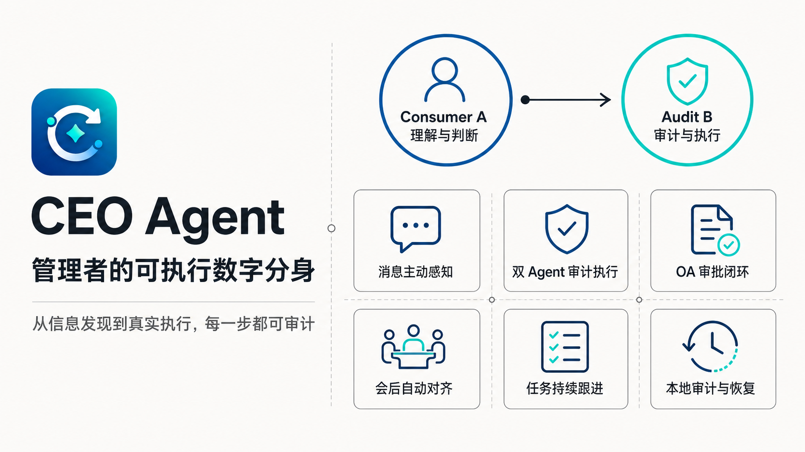

# CEO Agent Service



面向企业管理者的本地优先钉钉消息自动处理系统。

CEO Agent Service 会从钉钉读取私聊、群聊、在线文档、OA 审批、日程邀请和会议权限请求，把需要判断的消息交给 Codex Agent 处理，并把每一次决策、证据、发送结果和错误状态写入本地 SQLite，方便审计、反馈和持续修复。

> 这个项目的目标不是替人“随便自动回复”，而是把企业 IM 中可结构化处理的信息流接入一个可审计、可回滚、可人工接管的本地 agent 工作流。

## 适用场景

- 管理者每天收到大量钉钉消息，需要区分真正需要本人判断的事项、普通同步、系统通知和可自动处理事项。
- 团队希望在不迁移到新聊天产品的前提下，把 AI assistant 接入现有钉钉工作流。
- 公司内部知识、审批材料、会议记录和候选人信息较敏感，希望检索、生成、审计状态尽量保留在本地机器。
- 自动化回复需要可追踪：为什么回复、依据了哪些文档、是否调用了工具、是否真的发送成功。

## 核心能力

- **钉钉消息发现**：通过 `dws` 读取未读会话、@ 消息、群聊广播消息、配置机器人私聊消息，并用慢路径补扫防止漏消息。
- **结构化消息发现**：按会话来源、明确 @ 和稳定平台对象发现 trigger；业务类型和处理方式由 Agent 动态读取 Skill 判断，不使用关键词 router。
- **本地任务队列**：使用 SQLite 保存 `reply_tasks`、`reply_attempts`、`seen_messages`、`sent_replies`，避免重复处理和重复发送。
- **Consumer / Audit Agent 执行**：Consumer A 是管理者的 read-oriented representative，用原生 `codex exec` 读取材料、判断业务并提出精确候选；按角色协议不得主动执行外部写操作。Audit B 独立审阅，并且是 service 生命周期中唯一获授权发布 accepted action、执行和读回外部动作的 Agent。
- **后台 Codex 运行环境**：Consumer/Audit 沿用当前用户配置的 provider、登录态、MCP、plugins、hooks 和 skills；角色边界由 Agent 指令与结果协议约束，外部操作只通过服务注入的受控 `agent_cli` 执行。服务不复制或改写用户凭证和 MCP 配置。
- **CEO 画像数据准备**：从本地工作文档、AI 听记、历史发送样例和可读钉钉知识库中提取证据，蒸馏生成 `data/work-profile/work_profile.md`；运行时只通过 `work_profile_instruction()` 消费这个结果，让 agent 学习管理者的判断顺序、追问方式、表达风格和硬边界。
- **Skill-first 材料处理**：服务只传递材料引用、原始 ID、链接和精确读取命令；A 动态读取业务 Skill 和操作 Skill，自行决定展开哪些材料，B 按 verified Skill receipt 重读相同 Skill 并在写入前核对实时状态。
- **安全和质量检查**：服务校验严格 A/B 结构化 result、队列 generation 和精确 revision 去重；B 的外部动作必须有实时读回。DingTalk 和 Lark 使用显式通道 gate；Codex 直接沿用本地 App/CLI 登录状态，认证失败立即落为可见失败。写入结果未知时只在原 B session 中核对，不能盲目重放。
- **人工接管**：对需要本人处理的消息发送 handoff，并暂停该会话的自动回复直到检测到真人回复。
- **Task 总结**：从已处理对话、AI 听记和 `CEO_WORKSPACE` 新增文件里抽取公司管理事项、业务项目和重要 TODO，归档到 work project 并生成下一步和跟进草稿。
- **会后对齐 Agent**：发现 Derek 参会且已结束至少十分钟的会议；仅在存在观点分歧或需要输出 Derek 观点解读时生成跟进。多人会议默认发到 Agent 核验过、明确承接该业务或后续行动的团队群；涉及个人隐私、薪酬绩效或不适合公开的个人负面反馈时，可以私信相关参会人。
- **审计 Web UI**：本地 FastAPI 页面查看历史、attempt 详情、Codex session、错误、Prompt 模板和路由配置。
- **Agent Workbench**：在本地 Web 界面中创建 agent 任务、连续对话、查看流式事件和产物，并在高风险工具调用前进行人工确认。
- **自动修复 heartbeat**：消费 fail-closed 质量巡检结果，覆盖必需队列、最新 trigger、陈旧处理、外部投递、反馈和近期错误；将须恢复的问题与仍在进行的工作分开呈现。未知写操作只做只读核对，不自动重放。
- **管理者 OKR 周报**：每周日读取 CEO-2 管理群成员的实时叮当 OKR 和可访问证据，按 `dingtang-okr-review` 生成可审计评分、知识库报告和群内重点摘要。

## 按角色使用

推荐一位管理者部署一套本地服务，使用自己的 DWS/Lark/Codex 登录身份、SQLite、workspace、工作画像和反馈服务。
同事、HR、审批人员和项目人员不需要安装代码，只需在钉钉里按规则 @ 管理者或配置的 Agent 名称。飞书 CLI
是可选的材料读取和回复通路，不是默认启用的通用飞书收件箱。

安装者、管理者本人、普通同事、HR、OA 审批人员和运维审计人员的完整操作方式见
[docs/user-guide.md](docs/user-guide.md)。

## 系统架构

维护总览见 [docs/architecture.md](docs/architecture.md)。下面是产品视角的简版架构说明。

系统由八层组成：

1. **DingTalk Inputs**：群聊、私聊、配置机器人私聊、在线文档、文件、图片、OA、日程、会议权限请求。
2. **Producer 消息发现层**：快路径每分钟看未读；慢路径每小时补扫近期单聊和群聊。
3. **Producer 结构过滤层**：群聊必须 @ 触发；私聊不需要 @；只过滤可由平台结构证明的系统回执和重复 source revision，不按业务关键词路由。
4. **SQLite Queue 状态层**：保存待处理任务、处理尝试、已读消息、已发送回复。
5. **Channel Gate 层**：用 CLI status 和 authenticated probe 确认通道可用；只有明确 `needs_login` 才协调一次登录流程。
6. **Consumer Agent A 层**：同一对话复用一个原生 Codex session；A 动态发现并读取业务 Skill，再读取操作 Skill、材料并形成精确候选。
7. **Audit Agent B 层**：service 从 A 的 completed tool events 生成 verified Skill receipts；B 重读同一组 Skill，接受后执行并读回，业务含义变化通过结构化反馈回到 A。
8. **Audit / Observability / Recovery**：审计页面、macOS 通知、launchd、fail-closed 质量巡检和失败任务的可追踪恢复。

完整处理流是：

```text
trigger/context/material references
  -> Consumer A discovers and reads business Skill(s)
  -> A reads operation Skill(s) and proposes an exact action
  -> service derives verified Skill receipts from existing tool events
  -> Audit B rereads the same business Skill(s) and operation Skill(s)
  -> B reviews, executes, and reads back
  -> service persists the existing run/attempt/receipt state
```

Service 不解释业务材料，不替 Agent 选择文件或猜测 OA 对象，也不维护平行 Skill audit DB。详细工具
轨迹使用 Codex session JSONL；SQLite 只保存现有恢复状态和 receipt 指针。

七个随服务安装、按需加载的业务 Skill 是 `ceo-message-triage`、`ceo-calendar-invite`、
`ceo-document-review`、`ceo-meeting-work`、`ceo-mail-review`、
`ceo-personnel-communication` 和 `ceo-work-tracking`。OA、面试和 OKR 继续委派给现有专业 Skill，
不把专业规则复制进通用 prompt。Task extraction 与 follow-up 由 `ceo-work-tracking` 作为一个从
提取、建项、催办、验证到关闭的生命周期处理，不建立第二套回复路径。

Agent Workbench 的运行协议与模型提供商无关：SQLite 是任务、回合、确认和产物的权威状态，SSE 只流式传送可重放的事件，不成为第二份状态。需要外部效果的操作必须先生成持久化确认，只有当前回合的确认可以被消费。首个生产 runtime 是 Codex；Claude 和 Pi 尚未实现专用 adapter，未来只需实现同一事件、停止、恢复和确认契约即可接入。

当回复判断依赖 DWS 材料时，`codex exec` 内的只读 DWS 命令统一使用 900 秒 HTTP 超时。若 DWS 读取以临时网络错误或未分类的命令输出失败，且本轮没有记录其他可用材料，决策会被强制转换为 `blocked`，原 reply task 按指数退避重试；服务不会把材料读取失败改写成拒绝、追问或无依据回复。明确的登录或授权失败仍保持阻断，避免无效重试。

DWS 可能同时返回通用错误码和更具体的服务端错误码；服务始终按具体服务端错误码分类。日历、消息、通讯录和 AI 听记等只读命令遇到临时 `ERROR`、`RATE_LIMIT_ERROR` 或 `PREPARE_CALL_TOOL_ERROR` 会在当前调用内重试，写操作不使用这条通用重试规则。

`blocked` 只表示当前缺少权限、依赖、材料或安全条件。记录必须写明当前原因和恢复条件，始终保留在待处理 backlog；条件变化后通过原 trigger 的幂等 rerun 再次处理，不使用错误前缀把 blocked 永久排除。

单个访问失败反馈只允许 A 诊断并提出候选，不授权修改共享部署入口、域名、DNS、路由或基础设施配置。此类变更必须在上下文中已有至少 3 个相互独立的受影响案例，或 Derek 对该项具体变更给出当次明确授权；同一机器或网络上的重复探测只算一个案例。条件不足时保持配置不变并返回 `needs_human`。

一次 reply task generation 对应一个或多个 A/B run：同一 `conversation_id` 的 A run 复用 `conversations.codex_session_id`，每个候选 revision 创建新的 B run。单个 launchd 服务内的 consumer pool 允许不同会话并行处理；SQLite 原子认领和会话锁保证同一 A session 的 JSONL 顺序。运行审计以 Codex session JSONL 为准，业务数据库只保存 session ID、transcript 行范围、角色关系、operation ID 和恢复状态。任务终态采用严格 A/B result；服务在收到结果后本地校验 JSON，不使用 Codex CLI 的 `--output-schema` 传输参数。精确重复动作由 trigger、generation 与 revision 共同阻止，人工修订后的新内容不被旧结果拦截。

单一 launchd 服务默认每轮由 2 个 consumer 线程各处理至多 4 条 reply task。该限制提高积压恢复吞吐，不创建额外 launchd job；任务认领是原子的，同一会话仍必须先取得会话锁，所有外部动作仍走 Consumer A 与 Audit B 的审核和回读。

`rerun-message --force-new-decision` 会在当前 generation 结束后创建新 generation，但继续复用该对话的 Codex session；仍在运行的 Agent 不会被抢占，普通重复提交仍按同一来源 revision 去重。

所有服务启动的 Codex 通道（包括微信消费）均复用安装用户的 Codex 配置、MCP、插件和 skills。服务不会复制 OAuth 或 token；单个 MCP 的认证失败按实际依赖错误处理，不会触发 Agent 自行登录。微信任务将认证恢复资格作为独立状态持久化，不依赖提供方的原始错误文案。Codex 登录恢复后，消费者只会重新排入最近三天内、没有 delivery 或 `sent_replies` 记录、且带有该恢复资格的未开始决策任务；每条恢复任务都会创建新的 generation，已进入发送路径的任务不会自动重放。

A 和 B 使用同一套安装用户 MCP/plugin/Skill 环境，没有 service-owned MCP allowlist，也没有两阶段
MCP permission profile。某个继承 MCP 可能同时公开读写工具，service 不承诺能在技术上隐藏其中
每一个写能力。A/B 边界由角色协议、结构化结果和状态机建立：A 只应读取、判断和提出候选；只有
B 对 accepted candidate 的执行才会进入正式发布、读回和完成流程。

Agent 必须如实返回动作结果；只有诊断、没有完成用户要求的动作时不能标为 `executed`。可向对话参与者补齐的事实必须变成一个具体澄清消息候选，不得要求 Derek 选择“继续还是追问”。发送只允许当前 task generation 的 delivery，sender 必须先原子 claim 才能真实发送。

微信投递把“发送动作明确未执行”和“动作已经开始但送达未知”分开保存。前者记录实际界面失败阶段，并且最多自动重试两次；后者只读回消息记录后再决定，绝不因为重试而重复发送。

重复发送保护命中已有 `sent_replies` 时，新的发送 attempt 记为 `skipped`，不记为 `blocked`，也不写入 service error；这表示同一触发消息已处理完成，只是跳过了重复投递。对于唯一的受审私信动作，`sent_replies` 是服务的送达账本：已确认外部发送必须在同一事务记录账本；只要审计读回同一会话和消息标识，历史账本遗漏也会在不执行外部动作的前提下回填。未知结果但账本没有该 trigger 的送达记录时，服务终结旧 generation 并创建新的受审 generation；群消息、审批和其他外部动作仍必须依赖各自的精确读回，不能套用该规则。恢复执行以受控命令摘要、参数摘要和目标作为身份，命令显示名不是身份依据；候选声明的操作仍必须与受控命令分类一致。

## Codex 双认证运行时与故障切换

后台 Agent 的默认路由顺序是 `codex_oauth`（安装用户已有的 Codex OAuth
登录）后接可选的 `codex_api`（service-owned API credential）。API 路由不是一套
独立业务执行器；两条路由共用同一持久化 `agent_run`、能力快照、attempt ledger、
结果 codec 和 effect fence。API key 只在生成 `codex_api` 子进程环境时以
`OPENAI_API_KEY` 注入，不进入 argv、prompt、SQLite、History 或日志；OAuth 子进程
不会收到该变量。

运维人员可在不消费业务队列的情况下刷新两条路由的独立健康状态：

```sh
.venv/bin/ceo-agent probe-agent-runtimes \
  --db "$CEO_WORKER_DB" --workspace "$CEO_WORKSPACE"
```

每条路由有各自的 capability snapshot 和 pause。认证、容量、传输、能力、session、
结果协议和进程错误会以安全的 typed failure 持久化；只有明确允许 failover、尚未开始
外部效果、session 证据完整且只读策略成立的失败，才能选择下一路由。写入已经开始、
写入结果未知、session transcript 不完整或出现未审阅 action 时，服务进入只读
reconciliation，绝不通过切换 provider 重放写入。

部署按三阶段推进：Stage 1 只配置并探测两条路由；Stage 2 仅为 synthetic/read-only
workload 启用 OAuth→API 故障切换并核对同一 run 的 attempt 与 secret 扫描；Stage 3
只有在 Stage 2 留下完整证据后，才允许 Audit fallback，并必须用专用测试目标验证写入
前中断可安全切换、写入后中断只核对不重放。紧急回滚只需从
`CEO_AGENT_RUNTIME_ROUTES` 移除 `codex_api` 并重启服务；不要删除 attempt/History
证据，也不要把未知写入改成新一轮 OAuth 执行。

## 消息如何被处理

### 快路径

- Producer 每次运行调用 `list_unread_conversations(count=50)`。
- 对有新未读的会话读取 `read_unread_messages`。
- 同时读取配置中的本人 @ 别名、@所有人/@all 等 mention/broadcast 消息，避免未读状态不完整导致漏消息。
- 同时读取 `CEO_AGENT_NAMES` 或 `CEO_DING_ROBOT_NAME` 对应的机器人单聊，真人发给机器人的消息会进入 agent，并通过机器人账号回复。
- 通过路由规则后写入 `reply_tasks`。

### 慢路径

- 每小时补扫近期会话。
- 单聊：最近 24 小时、最多 50 个本地记录过的单聊。
- 群聊：最近 24 小时、最多 3 个本地记录过的群聊。
- 慢路径仍然遵守群聊触发规则：没有 @ 本人或广播 alias 的群聊消息不会进入 agent。

### 群聊规则

- 群聊消息必须 @ 本人，或命中配置的 broadcast alias，才进入 producer 判断。
- 群聊里的普通文档分享如果没有 @ 本人，不会触发 agent。
- 连续来自同一发送人的候选消息会合并成一个 reply task，避免同一上下文被拆成多次回复。

### 私聊规则

- 私聊不需要 @ 本人。
- 私聊消息经过未读/慢路径选择和系统通知过滤后，最新一条 remaining message 会进入 agent 判断。
- 私聊里的钉钉在线文档卡片会进入 agent 判断，不会因为渲染成图片/链接卡片就直接 `no_reply`。

完整规则见 [docs/message-routing-rules.md](docs/message-routing-rules.md)。

## 安全边界

默认设计是“本地优先”：

- 钉钉认证、Codex session、SQLite 数据库、语料库和业务材料不应提交到 Git。
- 默认使用 `CEO_NOT_SEND_MESSAGE=0` 正常处理消息和日历动作。
- dry-run 需要显式设置 `CEO_NOT_SEND_MESSAGE=1` 或使用 `--not-send-message` / `--dry-run`，只记录决策不发送。
- live send 仍需要 `CEO_LIVE_SEND_BLOCKERS_ACCEPTED=1` 作为显式确认开关。
- 回复不得暴露本地文件路径、session id、token、cookie、签名 URL 或工具原始输出。
- OA 审批必须读取完整审批材料、流程节点、附件和 SOP；无法确定时评论追问或 handoff。

## CLI 凭证

- DWS 和 Lark CLI 复用安装用户在各 CLI 标准位置维护的本地登录状态；服务不维护第二套凭证。
- 默认也不设置 `DINGTALK_DWS_AGENTCODE`。这样 DWS 的 PAT 行为授权与用户在终端直接运行 `dws` 时使用同一默认作用域；只有安装者显式设置 `CEO_DWS_AGENT_CODE` 或 `DINGTALK_DWS_AGENTCODE`，才会启用独立 AgentCode 作用域。
- Agent 不得执行 auth login/reset/logout，也不能自行弹出授权页面。
- Channel gate 在 Agent 前运行结构化 status 和 live authenticated probe。
- 只有明确 `needs_login` 时，Login Coordinator 才启动一次相应 CLI 登录；并发和抑制窗口内不会重复启动。
- 网络错误、status 不可读或一般命令失败不会触发登录。
- `Settings → Connectors` 展示 status、live probe、最近成功时间和登录抑制状态，不展示 PID、session、token 或凭证路径。
- History 只展示用户可理解的触发、回复、终态和安全结果摘要；运行时内部规划字段不进入页面。

## OKR 审核数据源

OKR 审核 runner 默认使用叮当 OKR Web live source，不再依赖本地 xlsx/raw JSON，也不会默认把叮当 OKR
误当成 Agoal 规则接口。

- `CEO_OKR_SOURCE_KIND=dingteam_web` 时，必须设置 `CEO_OKR_LIVE_SOURCE_COMMAND`。该命令接收
  `{user_id}` 和 `{period_label}` 占位符，并返回 worker 可用的实时 OKR JSON。
  本机 Dingteam Web source 命令示例：
  `CEO_OKR_LIVE_SOURCE_COMMAND=/Users/derek/miniforge3/bin/python /Users/derek/.agents/skills/dingtang-okr-review/scripts/dingteam_okr_browser_source.py fetch --user-id {user_id} --period-label {period_label}`。
  该命令使用 `dingtang-okr-review` skill 的专用 headless browser profile 和 token cache；登录态过期时先运行
  `/Users/derek/miniforge3/bin/python /Users/derek/.agents/skills/dingtang-okr-review/scripts/dingteam_okr_browser_source.py login`
  并扫码。脚本不读取普通 Chrome cookie、localStorage 或 session 文件。
- 只有确认企业 OKR 数据暴露在 Agoal objective API 中时，才设置 `CEO_OKR_SOURCE_KIND=agoal`。
- Agoal 模式从 `~/.dingtalk-skills/config` 或 `.env` 读取应用凭证；如果规则列表为空或不唯一，
  设置 `CEO_OKR_OBJECTIVE_RULE_ID`，否则服务会直接报错。
- 实时 API 获取失败时，服务会记录 history 并回复“现在无法获取实时 OKR 数据”，不会静默改用历史导出文件。
- 周报发布前通过 DWS 的 `chat +conversation-list --page-all` 按群名精确解析 CEO-2 管理群，再用
  `chat +chat-members-list --conversation-id ... --member-types user` 读取当前成员；群不可唯一解析或成员无法映射到通讯录时任务会停止，不会向其他群发布。
- 每位管理者的评分输出必须覆盖实时源中的全部 KR。若结构化校验发现缺项，系统会在发布前附带实际缺失原因重试一次；二次仍不完整则停止，不发布半成品。

## Agent 安装入口

推荐由 Codex 或其他本机 agent 按
[docs/agent-installation-runbook.md](docs/agent-installation-runbook.md) 执行安装。该 runbook 覆盖组件下载和校验
（`dws`、Codex CLI、Memory Connector、Nvwa skill）、交互式参数收集、`.env` 配置、数据 corpus 准备、
工作画像生成、审计 Web UI、launchd 常驻服务和权限检查。

组件准备优先由 agent 自动执行：

```bash
scripts/bootstrap-local-components.sh --format json
```

该脚本会安装 `terminal-notifier`，检查 Codex CLI 与 Nvwa skill，并把七个 CEO 业务 Skill 安装到
当前用户的 `~/.agents/skills`。它不会向 `~/.codex/skills` 安装用户 Skill，也不会覆盖同名的用户自有
Skill。只修复业务 Skill 时可运行：

```bash
scripts/bootstrap-local-components.sh --component ceo-business-skills --format json
```

DWS 和 Lark 已拆成 Tutorial
中的独立配置步骤：页面先检查 CLI 和登录状态；缺少 CLI 时点击对应按钮自动安装，未配置时再打开一次
CLI 自带的授权流程。DWS 的内部安装来源通过 `DWS_INSTALLER_PATH` 或 `DWS_INSTALL_COMMAND` 提供；
Lark 可通过 `LARK_CLI_INSTALL_COMMAND` 覆盖默认 npm 安装命令。

每个安装者应部署自己的一套 service，使用自己的 Codex、DWS/Lark 登录、SQLite、workspace 和可选
反馈服务。其他同事、HR、审批申请人和项目 owner 不需要安装代码，只需在原工作会话中与 Agent
交互。安装程序只管理带 `managed_by: ceo-agent-service` 标记的七个 Skill，升级时保留其他用户 Skill。

不要让使用者逐条复制终端命令完成安装。agent 应该自己执行命令、检查输出、编辑本机配置，只在需要用户完成
登录授权、扫码确认、macOS 权限点击、安装来源确认或 live-send 决策时打断用户。

下面的快速开始保留为 agent 执行和调试参考；新机器首次安装应优先使用 agent runbook。

## 快速开始

### 1. 准备依赖

需要：

- Python 3.11+
- 已认证的 `dws` CLI
- 可运行 `codex exec` 的 Codex CLI
- 可选：已认证的 Feishu/Lark CLI，默认二进制名为 `lark`
- 可选：Codex `exa` MCP 配置，用于需要外部检索的回复判断
- 可选：本地知识 workspace 和 graphify 输出

### 2. 安装本地服务

```bash
python3 -m venv .venv
"$HOME/miniforge3/bin/python" -m pip install -e '.[dev]'
npm install --prefix frontend
npm run test:workbench
npm run build:workbench
```

### 3. 配置环境变量

复制 `.env.example` 并按本机路径修改：

```bash
cp .env.example .env
```

常用配置：

| 变量 | 作用 |
| --- | --- |
| `CEO_WORKSPACE` | 本地知识 workspace，供 agent 检索 |
| `CEO_WORKER_DB` | SQLite 状态库路径；默认位于 `~/Library/Application Support/ceo-agent-service/auto-reply.sqlite3`，每天生成一次一致性备份并只保留一个最新快照 |
| `CEO_NOT_SEND_MESSAGE` | `1` 表示只记录不发送，`0` 表示允许发送 |
| `CEO_LIVE_SEND_BLOCKERS_ACCEPTED` | live send 的显式确认开关 |
| `CEO_CORPUS_DIR` | 本地风格语料目录 |
| `CEO_MEETING_PRODUCER_INTERVAL_SECONDS` | 会议信息发现周期，默认 60 秒 |
| `CEO_MEETING_CONSUMER_POLL_INTERVAL_SECONDS` | 会后对齐队列消费周期，默认 10 秒 |
| `CEO_MEETING_SETTLE_SECONDS` | 明确会议结束后的静默等待时间，默认 600 秒 |
| `CEO_REPOSITORY_UPGRADE_REMOTE` / `CEO_REPOSITORY_UPGRADE_BRANCH` | repository-upgrade 检查的 Git remote 和目标分支，默认 `origin` / `main` |
| `CEO_REPOSITORY_UPGRADE_CHECK_INTERVAL_SECONDS` | 自动检查远端更新的周期，默认 21600 秒（6 小时） |
| `CEO_REPOSITORY_UPGRADE_DISABLED` | 设为 `1` 禁用周期检查；History 页面仍可手动查看已保存状态 |
| `CEO_CODEX_MODEL` / `CEO_CODEX_MODEL_REASONING_EFFORT` / `CEO_CODEX_MODEL_PROVIDER` | Codex OAuth 默认模型、thinking 强度和可选 provider；默认 `gpt-5.5` + `medium`。在 `Settings → Agent Runtime` 中用下拉菜单修改；模型可选 `gpt-5.5`、`gpt-5.6-sol`、`gpt-5.6-terra`、`gpt-5.6-luna`。不提供 `gpt-5.6` 别名，因为 Codex CLI 的 ChatGPT OAuth 会拒绝该别名。保存到 `.env` 后重启主服务统一生效，认证与 MCP/skills 保持沿用当前安装用户配置。 |
| `CEO_AGENT_RUNTIME_ROUTES` / `CEO_CODEX_API_BASE_URL` / `CEO_CODEX_API_MODEL` / `CEO_CODEX_API_KEY` | 可选 Codex API fallback：在 `Settings → Agent Runtime` 启用，填写 Base URL、模型和 Token。已配置的 Token 以圆点掩码显示，页面不会重新下发密钥；眼睛按钮只显示或隐藏本次输入的内容。留空保存会保留已有 Token。 |
| `CEO_AGENT_RUNTIME_ROUTES` / `CEO_FRIDAY_RUNTIME_BASE_URL` / `CEO_FRIDAY_RUNTIME_PROJECT_ID` / `CEO_FRIDAY_RUNTIME_MODEL` / `CEO_FRIDAY_RUNTIME_PROVIDER_BASE_URL` / `CEO_FRIDAY_RUNTIME_PROVIDER_MODEL` / `CEO_FRIDAY_RUNTIME_PROVIDER_API_KEY` / `CEO_FRIDAY_RUNTIME_TICKET`（或 `CEO_FRIDAY_SESSION_TOKEN`） | 可选 Friday Runtime fallback：启用 `friday_runtime` 后填写 Friday Runtime 地址、project ID、Runtime provider 地址/模型/API Token 和一个 Runtime 凭据。Friday provider 配置使用独立的 `CEO_FRIDAY_RUNTIME_PROVIDER_*` 字段，不与 Codex API URL/key 共享；Runtime ticket/session token 仍只用于访问 Friday Runtime。本地无鉴权测试必须显式设置 `CEO_FRIDAY_RUNTIME_AUTH_DISABLED=1`。 |
| `CEO_CODEX_CAPACITY_RETRY_DELAY` | Codex 明确返回 workspace credits、quota 或 usage limit 后的全局暂停期；默认 30 分钟，暂停期内不再启动新的 Codex 回复、工作汇总或会议分析，过期后自动恢复 |
| `CEO_CODEX_CAPACITY_RETRY_MAX_DELAY` | Codex 容量持续不足时的最长探测间隔；默认 4 小时。探测从 `CEO_CODEX_CAPACITY_RETRY_DELAY` 开始逐次翻倍，成功后重置 |
| `CEO_FEISHU_CLI_BINARY` | 飞书 CLI 二进制名，默认 `lark` |
| `CEO_FEISHU_LIVE_SEND_ENABLED` | 飞书 CLI 真实发送开关，默认 `0`；未显式设为 `1` 时 `send_reply` 只返回 blocked，不会发送 |
| `data/mcp-doctor-state.json` | MCP doctor 的一次性提醒状态文件；用于避免 `needs_login` / `token_expired` 状态重复弹授权提醒 |
| `CEO_MENTION_ALIASES` | 群聊中触发本人的 @ 别名 |
| `CEO_DING_ROBOT_NAME` | handoff/DING 通知使用的机器人名称；默认服务启动配置为 `磊哥`，运行时解析 robot code |
| `CEO_AGENT_NAMES` | Agent 在群聊里的可 @ 名称列表；用户在群里 `@Agent名称` 时会按普通 @ 本人消息进入处理，多个名称用逗号分隔 |
| `CEO_ROBOT_DIRECT_MESSAGE_LOOKBACK` | 机器人私聊轮询窗口，默认 `4h` |
| `CEO_ASSISTANT_SIGNATURE` | 自动回复签名 |
| `CEO_HANDOFF_ACK` | 交给真人时发送的确认文本 |
| `CEO_FEEDBACK_SPIKE_VERCEL_BASE_URL` | 可选的对话方反馈页根地址；留空则不追加反馈链接。启用前必须把本仓库的 Vercel API 路由部署到安装者自己的 Vercel 项目，并填写自己的部署根地址；不要复用其他人的反馈服务 URL。配置后会在发出的回复末尾追加 `👍 赞｜👎 踩` 反馈链接；同一会话长期未评价时会升级为强提醒，超过硬阈值后只回复“请对我提供反馈后再提问” |

Friday Runtime fallback 的默认契约测试不访问网络或真实 provider：

```bash
.venv/bin/pytest -q tests/e2e/test_friday_runtime_fallback.py
```

它会在临时 HTTP server 中验证 `codex_oauth`、`codex_api` 失败后，
`friday_runtime` 在同一个 agent run 内成功，并检查 thread → turn → operation →
artifact 的调用顺序。

真实 Friday Runtime + MiniMax Chat Completions E2E 使用 `.env` 中独立保存的
`CEO_FRIDAY_RUNTIME_PROVIDER_*` 配置。不要直接 `source .env`，因为文件中包含并非
shell 语法的配置值。下面的命令只通过应用的解析器读取 Friday provider 配置，启动
临时 Friday 进程、project 和数据库，并显式启用 pytest 的 live marker：

```bash
python3 -c 'import os; from pathlib import Path; os.environ["CEO_ENV_FILE"]="/private/tmp/ceo-agent-service-live-missing.env"; from app.config import read_env_file; os.environ.update({k:v for k,v in read_env_file(Path(".env")).items() if k.startswith("CEO_FRIDAY_RUNTIME_PROVIDER_")}); os.environ["CEO_LIVE_FRIDAY_RUNTIME_E2E"]="1"; os.execvp("python3", ["python3", "-m", "pytest", "--run-live", "-m", "live", "tests/e2e/test_friday_runtime_fallback.py::test_live_friday_runtime_subprocess_minimax_chat_completions", "-q"])'
```

live 测试只发送 synthetic JSON prompt，不执行业务写入；它会验证 CEO runtime
attempt 和 Friday thread、turn、operation、run、Artifact 的完成状态，并检查运行时
diagnostics 及全部临时输出中不存在 provider token 泄漏。

不要把 `HOME` 指向项目目录。`dws` 和 Codex 需要使用真实用户环境里的认证状态。

### Repository upgrade

服务每六小时检查配置的 Git remote/branch（默认 `origin/main`）。History 页面只刷新升级提示，
不会重载整个页面；设 `CEO_REPOSITORY_UPGRADE_DISABLED=1` 可关闭周期检查，但仍可查看已保存状态。
升级只允许 fast-forward：分叉仓库或状态指纹变化时停止，不自动 merge、rebase 或覆盖本地改动。
脏工作树可以在明确确认分支名和提交信息后先保存，再继续升级；升级前创建经完整性校验的 SQLite
在线备份，并只保留一个最新快照。升级后会同步依赖、运行测试、重启 launchd 并核验新进程和 HTTP/Store
健康；验证失败只对本次安装的精确提交执行可证明归属的回滚。升级流程不会探测、禁用或覆盖用户的
Codex MCP 配置。

#### 可选：部署反馈链接服务

反馈链接不是公共服务，也没有仓库内置的默认域名。每个安装者如果要启用反馈链接，需要自己部署一套：

1. 在 Vercel 新建项目，源码指向本仓库或只部署 `api/dingtalk-feedback-spike*.js` 和 `api/feedback-storage.js` 相关路由。
2. 在 Vercel 项目里配置 `FEEDBACK_SPIKE_SECRET`，用于保护反馈事件查询接口。
3. 如果使用 Vercel Blob 存反馈事件，按 Vercel 的要求给该项目配置 Blob 存储环境变量。
4. 部署成功后，把该项目的根地址写入本机 `.env` 的 `CEO_FEEDBACK_SPIKE_VERCEL_BASE_URL`，例如 `https://your-feedback-service.vercel.app`。

不要把个人 `.vercel/` 项目绑定、部署 secret、Blob token 或某个安装者的真实 Vercel 域名提交到仓库。`.vercel/` 已在 `.gitignore` 中；`.env.example` 也默认留空，因此未配置时服务不会追加反馈链接。

### 4. 准备知识库

CEO Agent Service 会把“知识库”分成两类：本地知识库和外部可访问知识库。本地知识库由 `CEO_WORKSPACE` 指向；外部知识库通过 `dws`、Codex MCP 工具或当前消息材料按权限读取。

#### 本地知识库

建议把本地知识库放在项目目录之外，例如：

```text
/path/to/workspace/
├── AI听记/                    # 会议纪要、逐字稿、AI 总结
├── management/
│   ├── OA/                    # 审批原则、日历规则、SOP
│   └── strategy/              # 战略、组织、产品判断材料
├── recruiting/                # JD、岗位画像、简历和面试记录
├── Thinking/                  # 个人或团队沉淀文档
└── graphify-out/
    └── GRAPH_REPORT.md        # 可选：graphify 生成的结构化索引
```

准备步骤：

1. 把可检索的业务材料整理到 `CEO_WORKSPACE`，优先使用 Markdown、文本、可读的导出文档或已抽取正文的文件。
2. 在 `.env` 里设置 `CEO_WORKSPACE=/path/to/workspace`。
3. 对需要稳定执行的规则，放到明确路径，例如 `management/OA/审批原则.md`、`management/OA/日历规则.md`。
4. 可选运行 graphify，让 agent 先读 `graphify-out/GRAPH_REPORT.md`，再用本地文件验证具体事实。
5. 不要把真实知识库、会议记录、简历、审批材料放进 Git；这些内容应该留在本地 workspace 或被 Git 忽略的运行目录。

运行时，agent 会按 Prompt 规则先判断是否需要背景信息；需要时优先检索本地文件，再使用外部知识入口。回复正文不会暴露本地路径、检索命令、工具输出或内部审计细节。

#### 外部可访问知识库

外部知识入口取决于当前机器的认证和工具安装情况：

| 知识入口 | 能读什么 | 主要用途 | 边界 |
| --- | --- | --- | --- |
| 钉钉在线文档 / 知识库 | `dws doc info/read/list/search` 可访问的 Alidocs 文档、文件夹和知识库节点 | 读取消息里贴出的文档、构建工作画像、审阅材料 | 只读优先；访问范围由当前 `dws` 登录用户权限决定 |
| 钉钉 AI 表格 | `dws aitable` 可访问的 AI 表格、表、记录和附件信息 | 当链接类型是 AI 表格时读取结构化数据 | 不能当普通在线文档读；需要按表结构读取 |
| 钉钉普通文件 / 钉盘 | `dws doc` / `dws drive` 能定位或下载的普通文件 | 读取附件、简历、方案、审批材料 | 只有文件名不等于有正文；拿不到正文时不能凭文件名判断 |
| DWS 企业搜索 | `dws aisearch` 可访问的人员、知识、行为、群组和帮助中心搜索 | 本地资料不足时补查企业内知识、历史上下文或组织信息 | 搜索结果仍需可读材料验证，不能只凭标题下结论 |
| 钉钉会话上下文 | `dws chat` 可读的群聊、私聊、引用消息和历史消息 | 理解当前 trigger、前后文、是否已经有人处理 | 群聊仍必须满足路由规则才进入 agent |
| OA / 日程 / 联系人 | `dws oa`、`dws calendar`、`dws contact` 可读的审批、日程、组织信息 | 审批审阅、日程判断、识别本人和相关人员 | 审批动作必须满足 SOP 和材料完整性要求 |
| Memory Connector MCP | `memory_recall`、`memory_write`、`document_upload` 可访问的长期记忆 | 回忆历史决策、过往偏好、上次处理结果，并在回复后写入 episode | 不是替代业务文档的事实来源；关键判断仍要回到材料和上下文 |

钉钉知识库准备建议：

```bash
dws auth status --format json --timeout 5
"$HOME/miniforge3/bin/ceo-agent" channel-doctor
dws doc info --node '<alidocs-url>' --format json
dws doc read --node '<alidocs-url>' --format json
```

如果要把某个钉钉知识库纳入工作画像构建，可以使用知识库 ID 或知识库 URL：

```bash
cd /path/to/ceo-agent-service
"$HOME/miniforge3/bin/ceo-agent" build-work-profile \
  --workspace /path/to/workspace \
  --corpus-dir /path/to/data/corpus \
  --dingtalk-kb-workspace '<workspace-id-or-url>'
```

普通运行时不需要预先同步整个外部知识库。消息中出现钉钉在线文档、OA、日程、图片或文件材料时，worker 只把原始引用和精确读取命令交给 Consumer A；A 决定读取、展开和核对哪些材料，Audit B 在外部写入前独立复核。DWS 和 Lark 读取通过发布的 effect 元数据执行；下载后的 UTF-8 文本和 xlsx 文件分别使用专用 `read_text_file`、`read_spreadsheet` 工具。Consumer 不执行普通本地 shell、任意 Python 或未知程序。`agent_cli` 的每个受控工具都公开用途说明，确保 Agent 能按材料类型检索到日程、文档、文件等读取能力。受控重跑会启动新 Agent 会话，使新工具和新规则生效，不会恢复已失败会话中的旧工具调用；可重试但没有任何受控工具进展的 Consumer 回合也会清除旧会话后再试。读不到但能向对话参与者补齐的关键材料时，A 提出具体追问候选；不能猜测，也不要求 Derek 在“继续”与“追问”之间选择。

### 5. 数据准备：CEO 人格蒸馏

CEO Agent 不是只靠通用 prompt 模仿语气。人格蒸馏属于运行前的数据准备环节：服务会把可审计的工作证据蒸馏成一个 repo-local profile，供后续运行时读取。

1. `build-corpus` 从本地 AI 听记和会议资料生成风格语料。
2. `collect-corpus` 追加当前 `dws` 用户近期已发送的钉钉消息样例。
3. `build-work-profile` 汇总 `style_corpus.csv`、`CEO_WORKSPACE` 中的本地工作文档、以及 `dws` 可读的钉钉知识库文档，写入 `data/profile-evidence/evidence_index.jsonl`，并生成初版 `data/work-profile/work_profile.md`。
4. Nvwa persona skill 只在数据准备/复核阶段使用：读取 evidence index、style corpus 和初版 profile，重写 `data/work-profile/work_profile.md`，把大量具体证据压缩成稳定的心智模型、决策启发式、表达 DNA、价值观/反模式、核心张力和场景硬规则。
5. 运行时不加载 Nvwa，也不读取原始证据。`work_profile_instruction()` 只读取数据准备产物 `data/work-profile/work_profile.md`，把它注入 agent prompt，并明确要求 agent 不复述证据 id、本地路径或蒸馏过程。

这个 profile 不能覆盖硬规则：现实动作仍必须 handoff，审批/OA 必须看完整材料，人事敏感问题要谨慎，候选人判断必须看岗位和简历证据，回复正文不得暴露本地路径或工具细节。

更详细流程见 [docs/nvwa-work-profile-installation.md](docs/nvwa-work-profile-installation.md)；
逐步生成与每阶段是否满足的 checker 见
[docs/work-profile-distillation-tutorial.md](docs/work-profile-distillation-tutorial.md)。

### 6. 运行一次 dry-run

```bash
cd /path/to/ceo-agent-service
CEO_NOT_SEND_MESSAGE=1 "$HOME/miniforge3/bin/ceo-agent" run-once --not-send-message
```

### 7. 启动审计页面

```bash
cd /path/to/ceo-agent-service
"$HOME/miniforge3/bin/python" -m app.cli audit-web --reload --host 127.0.0.1 --port 8765
```

打开：

```text
http://127.0.0.1:8765/
```

常用页面：

- `/`：Agent Workbench，用于创建和继续 agent 任务、查看流式进度、产物与待确认操作
- `/history`：React SPA 回复与执行历史；“检索对象”可分别筛选普通钉钉回复、微信、审批、task 和 meeting，状态筛选支持 sent、reacted、skipped、blocked、failed 和 done。详情页统一显示业务结果，Runtime details 默认折叠。
- Attention 中的运行错误使用 `/history/errors/{error_id}` 只读详情页；错误记录 ID 属于 `errors` 表，不会再被误当成 `reply_attempts` 的 Attempt ID。
- History 的状态筛选按当前可处理性展示：同一触发消息或同一会后任务已经有后续结果时，旧 `failed` / `blocked` / `ready_to_send` 行保留为审计证据，但不再进入 active failed/blocked/pending 筛选；尚无后续结果的 blocked 统一显示为可恢复的 `Blocked`。
- `/tasks`：work projects、状态、category filter、Priority/Risk 排序、TODO checklist、实时全文检索和分页
- `/tasks` 页面中的 `Sent TODOs` 通过 `/api/console/tasks/sent-todos` 加载结构化的 DingTalk Todo 与 follow-up 发送记录；该 API 必须放在 `/api/console/tasks/{project_id}` 动态路由之前，避免 `sent-todos` 被当成项目 ID 解析。
- `/tasks/{project_id}`：单个 work project 详情、facts、TODO DDL/owner、更新记录和 follow-up 记录；Facts 在桌面端为宽 Description/Source 与固定操作列的可比较表格，在移动端为单列事实卡片，完整描述和来源可逐条展开
- `/attempts/{id}`：单次处理详情；同一触发消息后续重跑成功时，旧记录顶部会链接到后续 attempt 并展示其最新动作，原始状态仍保留在详情字段中供审计。Consumer 与 Audit 执行记录只能从该 Attempt 打开，不显示内部会话标识或本地文件路径。
- `/developer-prompt`：Developer/User Prompt 模板管理
- `/settings`：Settings 使用 React SPA 统一导航（Status、Info、Configuration、Agent Runtime、Prompts、Connectors、Audit Rules、Attention）。Configuration 汇总 `.env` 中的运行参数和 Prompt variables；Prompts 页面用 Developer/User tab 与 Template/Rendered preview 切换；Connectors 内含 DingTalk、Lark、WeChat；Workers 通过 `/status` 映射到 Runtime Monitor，Attention 单独展示未解决运行项。`/config`、`/workers`、`/logs` 保留为兼容入口并在 SPA 内映射；Logs 不再作为 Settings 一级导航。

除 DingTalk bridge/popup、通知 Service Worker 和 `/api/workbench/*` 外，业务页面统一由同一个 React SPA 渲染。FastAPI 的 `/api/console/*` 按 History、Tasks、Settings、Feedback、Tutorial、Notifications、Codex 和 WeChat 领域返回 JSON DTO；因此 `/tasks/836` 等业务深链可以直接打开或刷新，而未知 `/api/*` 仍返回 JSON 404。
- `/errors`：错误列表

### 8. 启用 task 总结

Task 总结以项目为主线记录管理事项、产研事项、业务项目和其他重要事项。每条新处理对话会生成一个结构化 Work Item，task agent 再结合 BM25 候选、DWS 上下文和 Memory Connector 判断是更新现有项目还是新增项目。

核心字段：

- `work_projects`：项目标题、分类、背景、owner、优先级、状态、下一步、事实列表。
- `work_todos`：归属项目、owner、优先级、due time、状态和来源。
- `work_updates`：每次 task agent 对项目/TODO 的更新说明、来源和后续动作。
- `follow_up_drafts`：到期后需要在群里或私信询问 owner 的消息草稿和发送状态。
- `work_todo_dingtalk_links`：内部 TODO 和钉钉 Todo 的同步状态、外部 task id、最近 pull/push 时间和错误信息。

Task 分类包括：

```text
management, strategy, projects, marketing, research, dev, product,
recruiting, sales, finance, admin, HR, other
```

主服务会自动运行 task maintenance：

- 每 `CEO_TASK_WORK_ITEM_INTERVAL_SECONDS` 秒消费一次 reply worker 写入的 Work Item，默认 60 秒。
- 每 `CEO_TASK_DAILY_INTERVAL_SECONDS` 秒扫描 AI 听记、本地新增文件、拉取钉钉 Todo 完成状态并处理到期 follow-up，默认 86400 秒。
- `refresh-okr-archive --period-label '2026 Q3'` 会只读拉取 CEO-2 管理群成员的实时叮当 OKR，
  写入 `CEO_WORKSPACE/OKR档案/<period>/company_okr_<period>_raw.json` 和
  `CEO_WORKSPACE/OKR档案/latest_company_okr_index.md`。task agent 会把 latest index 作为公司目标参照，
  用于判断事项是否和 OKR/KR、关键项目或管理风险有关；该索引不是 TODO 完成证据。
- 钉钉 OA 待审批扫描默认开启，由 `CEO_OA_PENDING_SCAN_ENABLED` 控制；扫描间隔由
  `CEO_OA_PENDING_SCAN_INTERVAL_SECONDS` 控制，默认 3600 秒；每次扫描查询最近
  `CEO_OA_PENDING_SCAN_LOOKBACK_DAYS` 天的待审批，默认 365 天。扫描只会在审批详情中
  确认当前登录用户存在 RUNNING 审批节点时入队，避免猜测 task id；同一审批仅在首次到达
  当前用户、任务 ID 变化或申请方产生新的审批操作/留言时再次入队；服务自身写入的审批
  评论不会触发同一审批单的重复审阅。该扫描器独立运行，不会被
  长时间的普通消息处理阻塞。每个 Audit Agent B 的已核验审批动作都会随流程 ID、任务 ID 和
  回读结果写入审批 History；服务启动时还会从精确匹配的已完成扫描任务回填旧记录，避免把
  实际已审阅的审批误显示为普通回复或过期状态。审批 History 按流程实例显示当前有效审阅结果，
  同流程的技术重试仅保留在详情审计中，不会覆盖最近一次有效审阅。若 Codex 进程或严格结构化结果可安全重试但所属会话已卡住，
  服务会清除该任务和会话的关联；结构化结果无效时即使已到普通重试上限，也只额外安排一次干净会话重试，随后仍失败才终态失败。
  对同一流程的后续扫描，服务会把已核验的审批动作作为幂等依据交给 Agent：先读取实时状态，
  不重复已确认的同一动作；只有新增证据要求不同动作时才可再次处理。

钉钉 Todo 是 owner 执行层，不替代 `/tasks` 里的内部项目管理视图。只有明确 owner、due time、非敏感且未完成的高置信 TODO 会创建钉钉 Todo；Derek 默认不作为执行人加入。内部 `work_todos` 仍是主数据，钉钉 Todo 只同步创建、完成状态拉取和有强证据时的完成推送。发送 follow-up 前会先检查已关联的钉钉 Todo 状态：如果钉钉侧已经完成，系统会关闭内部 TODO 并跳过提醒，避免重复催办。创建阶段没有取得外部 task id 的 `TOKEN_VERIFIED_FAILED` 或安全校验调用失败，会保留原始提交内容并自动重试一次；第二次仍失败保留明确错误，不会无限创建重复待办。

Follow-up 发送使用稳定的幂等键。若钉钉返回登录、权限或已识别的目标错误，服务保留明确原因；若发送命令仅返回无业务码的未知结果，服务将草稿延迟重试并复用同一幂等键，而不是标记为不可恢复的失败。重复请求会由钉钉幂等回执收敛，避免重复催办。

可见性：

- `/tasks/{project_id}` 的每个 TODO 下会显示钉钉 Todo 的 task id、状态、最近 pull/push 时间和错误。
- `/logs` 会显示 `DingTalk Todo` 类别的创建、拉取和完成同步记录。
- `daily-task-maintenance` 输出包含 `dingtalk_todos_closed`，表示本次从钉钉 Todo 拉取后关闭的内部 TODO 数量。

手动补跑命令：

```bash
cd /path/to/ceo-agent-service

# 处理 reply worker 已写入的 Work Item
"$HOME/miniforge3/bin/ceo-agent" process-work-items --max-batches 20

# 扫描新增 AI 听记和 CEO_WORKSPACE 下的新增 Markdown/text 文件
"$HOME/miniforge3/bin/ceo-agent" scan-task-sources

# 扫描当前登录人的钉钉 OA 待审批
"$HOME/miniforge3/bin/ceo-agent" scan-oa-approvals

# 扫描、处理 Work Item、处理到期 follow-up
CEO_NOT_SEND_MESSAGE=1 "$HOME/miniforge3/bin/ceo-agent" daily-task-maintenance --not-send-message
```

`scan-task-sources` 的本地文件扫描只读取 `CEO_WORKSPACE` 指定路径，不会全盘扫描。AI 听记通过当前 `dws` 登录态从最新页读取到已记录的时间边界；首次只建立最新页基线，后续在到达该边界时停止，不会为查找历史 ID 持续使用易失效分页游标。旧版仅含 ID 的状态会安全读取一页、处理该恢复窗口中未记录的条目，并建立时间边界。

CEO reply agent 使用原生 `codex exec`，沿用启动服务的安装用户现有 `~/.codex` 配置、MCP、
plugins、hooks、Skills 和认证状态。服务不会把 MCP transport、OAuth header、bearer token 或
其他凭证复制到仓库、`.env` 或第二份 service-owned 配置中。A/B 运行时使用不同角色指令和结果
协议，并可叠加 service 自有的 `agent_cli`；这不会替换安装用户的 Codex 配置，也不构成一套覆盖
所有继承 MCP 的技术权限隔离。

- CLI 能力：`dws` 和 Feishu/Lark CLI 使用安装用户原有登录态；服务在执行前做 channel gate。
- MCP/skills：直接来自用户的 Codex 安装。Consumer A 与 Audit B 复用相同环境；A 按协议只做
  读取、判断和提案，B 负责独立审阅后的 accepted action 执行与发布。

认证仍由 Codex CLI、plugin、MCP 和各 CLI 的原生登录管理。Agent 不执行 login/reset/logout；
依赖缺失、认证失败、网络失败或工具不可用会按真实错误暴露，不会被改写成空结果或“对方没给材料”。

Codex CLI 的原生 session JSONL 是运行审计。服务只保存 session ID 和每个 run 的 transcript 起止行，避免复制工具参数、结果和另一套回执状态机。

MCP doctor 可以报告 `memory_connector`、`exa`、`xiaoqing_interview` 等依赖状态，但诊断配置不是
Direct Agent 的另一套运行清单，也不负责复制或补全用户凭证。`needs_login` 和 `token_expired`
只记录/提醒，不让 Agent 自己触发登录循环。
手动检查：

```bash
"$HOME/miniforge3/bin/ceo-agent" doctor-mcp --verify-live
```

Memory 与其他 MCP 一样来自安装用户现有的 Codex 配置和认证。若当前 Codex session 可以调用
`memory_connector`，service 启动的 Direct Agent 会沿用同一能力；若调用失败，任务记录实际依赖
错误。Service 不读取、转存、刷新或重新签发 Memory token。

Follow-up 发送仍遵守 live-send 安全边界：默认 dry-run 时只生成/记录草稿；真实发送需要 `CEO_NOT_SEND_MESSAGE=0` 且显式设置 `CEO_LIVE_SEND_BLOCKERS_ACCEPTED=1`。

## 生产运行

本项目提供 macOS `launchd` 模板：

```bash
npm install --prefix frontend
npm run test:workbench
npm run build:workbench
scripts/install-auto-reply-agents.sh
```

安装前请先检查 `launchd/*.plist` 中的本地路径、用户名、workspace、数据库路径和 persona 配置。开源部署时通常需要替换这些值。安装脚本会在修改 plist 或 launchd 前验证 Workbench 的 `index.html` 和它引用的每个资源；缺少构建时直接失败，不会自动执行 npm install/build。

运行模型只有一个 launchd job。它的 supervisor 运行 worker 和审计 Web 两个独立子进程；它们共享 SQLite，但不共享 Python 解释器。任一子进程退出时，supervisor 只退避重启该子进程，另一方继续服务；不会创建 meeting crontab 或第二个 plist：

- `com.ceo-agent-service.main`：唯一 launchd job，托管队列 worker 与本地审计页面。
- producer loop：按 `CEO_PRODUCER_INTERVAL_SECONDS` 间隔发现消息并入队，默认 60 秒。
- consumer pool：单一 launchd 服务内按 `CEO_CONSUMER_WORKERS` 启动 2 条受限 consumer 线程；每条按 `CEO_CONSUMER_POLL_INTERVAL_SECONDS` 间隔领取任务、调用 agent、执行发送或跳过，默认 10 秒。同一会话仍串行。
- meeting producer loop：读取 AI 听记与日历参会证据，只为 Derek 参会且明确结束至少 `CEO_MEETING_SETTLE_SECONDS` 的会议建队列；没有匹配日程的临时通话，仅在完整转写恰好证明 Derek 和另一位唯一员工时按 1:1 放行；没有触发条件的会议保持安静。
- meeting consumer loop：独立分析并投递；多人会议由 Agent 使用 DWS 查找并选择有明确业务承接关系的团队群，议题相似、参会人重合或近期活跃本身不构成投递证据。多人会议默认发群；内容涉及个人隐私、个人薪酬绩效或对特定个人的严厉负面反馈、不适合群聊时改为私信。只有群发现完整成功且没有可发送群时，才默认私信日历中唯一的会议创建人；创建人身份由发送层通过 DWS 唯一验证。DWS 读取或网络失败、群元数据不完整、创建人缺失或不唯一时保持可恢复重试，不猜测收件人。发送正文固定以 `【会议跟进】会议标题（会议时间）` 开头，便于收件人识别来源会议；真实 @ 默认限于参会人，非参会人只有会议转写明确说到是他的任务、由他负责、交给他确认或跟进时才 @。确认发送成功后复用 reply agent 的本地/Chrome notification 和钉钉会话点击跳转。dry-run 只分析到 `ready_to_send`，不会 claim 发送。
- `replay-recent-meetings` 会重新读取日历和听记证据，并只重开没有任何发送回执的 `no_action` 或 `failed` 会议任务；已发送或存在发送回执的任务保持终态，避免重复外发。
- task maintenance loop：按 `CEO_TASK_WORK_ITEM_INTERVAL_SECONDS` 处理 Work Item，并按 `CEO_TASK_DAILY_INTERVAL_SECONDS` 扫描 AI 听记、`CEO_WORKSPACE` 文件和到期 follow-up。

这些周期参数统一在审计页 `Settings → Configuration → Scheduling` 中维护，保存到 `.env` 后由 Python 服务启动时读取；launchd 模板不再在 shell 命令里写死或覆盖这些周期值。

meeting producer 首次启用时会持久化激活时间。服务启动恢复队列前，会把激活时间以前且从未尝试发送的历史任务统一标记为 `no_action`；因此切换瞬间已被旧进程领取的历史会议也不会在重启后重新进入分析或发送。

实际时长小于 5 分钟的听记在日历匹配和建队列前跳过；实际候选人面试由 agent 根据标题、摘要、参会人和完整转写识别并终止为 `no_action`。招聘站会、招聘计划、人才讨论和招聘需求对齐仍按普通业务会议处理。

会后队列状态为 `waiting → pending → processing → no_action | ready_to_send → sent`；可重试错误进入 `retry` 并带 `available_at`，Codex 结构化输出或历史来源协议偶发不合格也会先按可重试错误处理，达到上限后才隔离。发送结果不确定但有 `openTaskId` 时只核验状态，不重复发送；notification 只在最终确认 `sent` 时弹出一次。普通 reply task 的当前 `failed`、`blocked` 和未审阅 `needs_human` 状态汇总到 `/notifications`；浏览器通知按业务 trigger 固定，而不是按单次 attempt 编号固定。后续结果进入 sent、skipped 或其他终态时会主动关闭同一 trigger 的旧问题通知。关闭通知使用独立的浏览器事件类型，旧版页面会忽略它，不会把关闭操作渲染成空白弹窗。点击详情页会先显示当前可执行结论：已发送、已跳过或已有后续处理的历史记录明确显示“无需操作”且不提供重跑；只有当前失败记录可重新处理；真实 `needs_human` 会显示经审计的待决摘要。dry-run 不发布。meeting run 和 reply attempt 共用 History 时间线、搜索、状态过滤、24 小时事件图和 Codex session 详情。

本地 dry-run 验证：

```bash
CEO_NOT_SEND_MESSAGE=1 "$HOME/miniforge3/bin/python" -m app.cli service \
  --host 127.0.0.1 --port 8765
```

上线前可检查 SQLite：

```sql
select status, count(*) from meeting_alignment_jobs group by status;
select id, job_id, status, codex_session_id, created_at
from meeting_alignment_runs order by id desc limit 20;
```

受控回放最近 N 条听记（会重开其中未发送的历史 `no_action`，但不会重开 `sent`）：

```bash
CEO_NOT_SEND_MESSAGE=0 CEO_LIVE_SEND_BLOCKERS_ACCEPTED=1 \
  "$HOME/miniforge3/bin/ceo-agent" replay-recent-meetings --limit 10
```

可用 `--offset` 跳过已完成的小批量窗口，例如先跑 `--limit 1`，确认后再跑 `--limit 9 --offset 1`，两次合计覆盖最新 10 条且不重复。

手动发送已审阅 attempt：

```bash
cd /path/to/ceo-agent-service
CEO_NOT_SEND_MESSAGE=0 CEO_LIVE_SEND_BLOCKERS_ACCEPTED=1 \
  "$HOME/miniforge3/bin/ceo-agent" send-attempt --attempt-id 123
```

重跑指定消息：

```bash
cd /path/to/ceo-agent-service
"$HOME/miniforge3/bin/ceo-agent" rerun-message \
  --conversation-id '<openConversationId>' \
  --message-id '<openMessageId>' \
  --force-new-decision
```

## 风格语料和工作画像

可从本地会议纪要和已发送钉钉消息构建风格语料：

```bash
cd /path/to/ceo-agent-service
"$HOME/miniforge3/bin/ceo-agent" build-corpus \
  --workspace /path/to/workspace \
  --corpus-dir /path/to/data/corpus
```

追加当前 `dws` 用户的近期钉钉发送样例：

```bash
cd /path/to/ceo-agent-service
"$HOME/miniforge3/bin/ceo-agent" collect-corpus \
  --workspace /path/to/workspace \
  --corpus-dir /path/to/data/corpus
```

工作画像生成依赖本地 Nvwa persona skill 做证据归纳和人工复核。安装与数据准备见
[docs/nvwa-work-profile-installation.md](docs/nvwa-work-profile-installation.md)，生成流程见
[docs/work-profile-distillation-tutorial.md](docs/work-profile-distillation-tutorial.md)，其中包含每阶段 checker。

## 项目结构

```text
.
├── app/                         # Python 应用包、CLI、worker 和资源
├── frontend/                    # React/Vite Agent Workbench 源码与测试
├── tests/                       # Python 测试
├── docs/                        # 架构图、DWS 能力、消息路由和产品逻辑文档
├── launchd/                     # macOS launchd 模板
├── app/defaults/                # 首次运行会复制到 data/ 的默认 Prompt 模板
├── data/                        # SQLite、Prompt override、corpus、profile 等本地运行态数据
└── scripts/                     # 安装和运行辅助脚本
```

## 开发和测试

运行测试：

```bash
cd /path/to/ceo-agent-service
npm test
```

`npm test` 使用统一的 `$HOME/miniforge3/bin/python -m pytest` 运行 Python 测试，并先运行 Ruff，再运行 Workbench 前端测试。仓库不创建或依赖私有 `.venv`。修改 Workbench 后的本地集成流程是：

```bash
npm install --prefix frontend
npm run test:workbench
npm run build:workbench
"$HOME/miniforge3/bin/python" -m app.cli audit-web --reload --host 127.0.0.1 --port 8765
```

构建产物写入被 Git 忽略的 `app/static/workbench/`；FastAPI 在 `/` 精确返回其 `index.html`，并从 `/workbench-assets/` 提供带哈希的 JS/CSS。在构建之前启动页面会明确返回 503，安装脚本也不会自动下载依赖或构建。

安装了 Chrome 和 Python `dev` 依赖后，可针对生产构建运行真实浏览器布局回归：

```bash
WORKBENCH_BROWSER_TESTS=1 "$HOME/miniforge3/bin/python" -m pytest tests/test_workbench_browser.py -q
```

只跑相关测试：

```bash
cd /path/to/ceo-agent-service
"$HOME/miniforge3/bin/python" -m pytest tests/test_worker.py -q
```

Live smoke tests 默认跳过，只有显式设置环境变量时才会访问真实钉钉或发送外部可见消息。

本地检查全部持久化队列覆盖、当前 backlog 和默认 channel gate：

```bash
"$HOME/miniforge3/bin/python" -m app.cli quality-check --db "$CEO_WORKER_DB"
```

命令成功不代表没有任何工作正在进行；`attention` 表示新鲜的排队或恢复，
`violations` 才会使退出码非零。运行契约、数据源、阈值和当前覆盖边界见
[docs/quality-inspection.md](docs/quality-inspection.md)。

## 文档

- [docs/user-guide.md](docs/user-guide.md)：按安装者、管理者、同事、HR、OA 和运维角色组织的使用教程。
- [docs/agent-installation-runbook.md](docs/agent-installation-runbook.md)：给 agent 执行的端到端安装流程。
- [docs/product-logic.md](docs/product-logic.md)：产品逻辑、审计、安全默认值。
- [docs/quality-inspection.md](docs/quality-inspection.md)：质量巡检、收敛规则、输出契约和演进计划。
- [docs/message-routing-rules.md](docs/message-routing-rules.md)：消息类型、路由条件和已实现规则。
- [docs/dws-capabilities.md](docs/dws-capabilities.md)：项目使用的 DWS 能力。
- [docs/dws-command-inventory.md](docs/dws-command-inventory.md)：本机 `dws` CLI 能力清单和安全边界。
- [docs/work-profile-distillation-tutorial.md](docs/work-profile-distillation-tutorial.md)：工作画像生成教程。
- [SECURITY.md](SECURITY.md)：安全策略。
- [CONTRIBUTING.md](CONTRIBUTING.md)：贡献指南。

## 开源部署提醒

这个仓库可以开源代码和通用模板，但真实部署时请确认：

- 没有提交真实 SQLite、日志、Codex session、语料 CSV、工作画像或钉钉导出材料。
- `.env`、keychain、token、cookie、DingTalk 机器人 code 不进入仓库。
- `launchd` 模板中的个人路径和 persona 已替换。
- README 中的架构图不包含敏感公司信息。

## License

MIT
