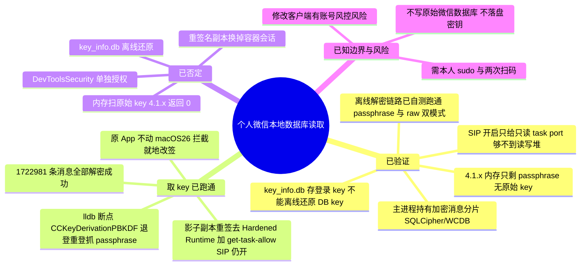
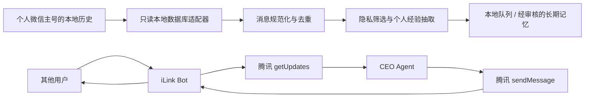

# 微信个人 CEO 助手：通道能力与本地记忆技术调研

日期：2026-07-18  
范围：腾讯 `openclaw-weixin` 官方通道、Mac 微信本地消息读取，以及个人经验（Memory）抽取。



## 结论

腾讯维护的 [`openclaw-weixin`](https://github.com/Tencent/openclaw-weixin) 是 **iLink Bot 通道**，不是把个人微信主号开放成 API。

- 手机微信扫码是为该通道绑定/创建 Bot 凭据：登录结果同时返回 `ilink_bot_id`、`bot_token` 和扫码者的 `ilink_user_id`；三者是分开的身份。[登录实现](https://github.com/Tencent/openclaw-weixin/blob/main/src/auth/login-qr.ts)
- Bot 收到的是其他用户发给 Bot 的新消息；当前插件把它们建模为 `direct` 单聊，而不是个人主号已有的单聊、群聊或历史记录。[入站实现](https://github.com/Tencent/openclaw-weixin/blob/main/src/messaging/inbound.ts)
- Bot 的发送实现固定填写 `message_type: BOT`，因此接收方收到的是 Bot 发言，**不是用户个人主号替身发言**。[发送实现](https://github.com/Tencent/openclaw-weixin/blob/main/src/messaging/send.ts)
- 该通道请求腾讯 iLink 服务，使用 `ilink_bot_token`，并上报可配置的 `bot_agent`；它不是“仅在本机运行、腾讯不可见”的方案。[API 实现](https://github.com/Tencent/openclaw-weixin/blob/main/src/api/api.ts)

因此，个人 CEO 助手应采用两条明确分开的路径：



Bot 可作为一个可选的、独立身份的实时沟通入口；个人主号的历史理解和经验沉淀，应通过本地数据库读取实现。不要把 Bot 当成个人微信主号的 API 或主号自动发送通道。

### 本地读取·结论速览（2026-07-18）

本机为 WeChat `4.1.10`、Apple Silicon、macOS 26.5.2、SIP 开启。已把技术链路彻底查清并自证：

- **能不能只读离线拿到 key？不能。** `key_info.db` 存的是登录 key（非 DB key，已穷举证伪）；4.1.x 内存里不再有原始 key，只有登录时现算的 32 字节 passphrase；SIP 开启只给到**只读 task port**，够不到 passphrase 所在的读写堆。真正的门槛是 WeChat 的 **Hardened Runtime**（不是 SIP）。
- **解密链路已就绪并自测通过。** 随附 `wxlocal.py` 支持 passphrase/raw 双模式，已用已知密钥的 SQLCipher-4 库验证：能解密、中文完整、HMAC 0 失败。**只差真实 passphrase 这一个输入。**
- **取 passphrase 需要一次特权步骤，按对账号的风险从低到高：**
  1. **官方导出 / UI 只读**（零改动、零风控风险，但覆盖有限）——正在评估可行性；
  2. **临时禁用 SIP** 后附着调试器抓取（不改客户端，但需两次重启、系统完整性短暂降低）；
  3. **就地/副本重签名去 Hardened Runtime** 后 lldb 断点 `CCKeyDerivationPBKDF` 抓 passphrase（已被 2026 年多款工具在 4.1.10 验证可行，但**修改客户端有个人号被风控/限制的现实风险**）。
- **实际选择（2026-07-18）：** 经本人确认后采用只重签用户目录影子副本的方案；官方 `/Applications/WeChat.app` 未被修改，SIP 始终开启。取得账号级 passphrase 后，日常增量读取不再运行影子副本或调试器。

### 简化理解

可以把整体能力概括为：

```text
个人微信主号的本地历史  -> 本地数据库读取 -> 上下文与个人经验
Bot 对话的新消息          <-> openclaw-weixin <-> Bot 身份的回复
```

也就是说，`openclaw-weixin` 解决的是**独立 Bot 身份**在 Bot 会话中的收发；本地数据库读取解决的是个人主号已落盘历史的读取。个人微信主号自动发送不能靠 iLink 完成；本项目现已用本机 Accessibility 驱动官方微信 UI 跑通，但这不是官方 API，也不是无 UI 的私有协议。

## 1. `openclaw-weixin` 到底能收发谁的消息？

| 场景 | 是否支持 | 依据与边界 |
| --- | --- | --- |
| 其他人给 iLink Bot 发新的单聊消息 | 是 | `getupdates` 交付入站消息，插件将其映射为 `ChatType: direct`。 |
| Bot 回复该用户 | 是 | 出站消息的接收人是入站的 `from_user_id`；协议要求把该消息的 `context_token` 原样带回。 |
| Bot 向已经互动/已配对的用户发送消息 | 有条件 | 插件维护 `allowFrom` 配对授权，发送 API 需要用户 ID；实际是否允许脱离入站上下文主动发送，官方协议与源码均未提供保证，应在测试账号上验证后才启用。 |
| Bot 向个人主号任意联系人主动发送 | 无证据，不应假设支持 | 源码没有联系人列表、主号会话列表或“以主号身份发信”的接口。 |
| 读取个人主号已有单聊/群聊历史 | 否 | API 只有实时 `getupdates`，没有历史消息查询接口。 |
| 以个人主号身份给他人发送 | 否 | 源码明确以 `BOT` 消息类型发送。 |
| 群聊收发 | 当前插件未实现 | 入站上下文固定为 `direct`；不能据此宣称支持微信群。 |

### 身份与收发链路

1. 用户用**个人微信**扫描二维码。
2. 腾讯 iLink 服务返回 Bot 的 `ilink_bot_id` 和 `bot_token`，同时记录扫码用户的 `ilink_user_id`。
3. 其他用户与这个 Bot 建立对话（必要时完成配对）。
4. 腾讯将新消息通过长轮询 `getupdates` 交给 Agent。
5. Agent 以 Bot 身份调用 `sendmessage` 回复。

`context_token` 是逐条入站消息发放的回复上下文，官方 README 明确要求发送时回传。尽管当前源码在 token 缺失时仍会尝试请求，不能将这一实现细节理解为“可对任意人无限制主动推送”。[协议说明](https://github.com/Tencent/openclaw-weixin/blob/main/README.zh_CN.md) [配对实现](https://github.com/Tencent/openclaw-weixin/blob/main/src/auth/pairing.ts)

## 2. 个人微信历史：本地数据库读取方案

### 目标和非目标

目标是**只读**地把个人主号的本地历史转换为统一消息事件，用于上下文理解和个人经验抽取；不修改微信数据库、不伪造主号发信、不依赖云端历史 API。

Mac 微信数据通常位于容器目录下的账号级 `db_storage`。数据库受 WCDB/SQLCipher 加密保护，不能把 SQLite 文件直接当作明文读取。腾讯的 [WCDB](https://github.com/Tencent/wcdb) 是相关的底层数据库框架；当前已知社区工具 [`wechat-cli`](https://github.com/huohuoer/wechat-cli) 的说明仅覆盖 Mac 微信 `<= 4.1.8.100`，不能据此承诺兼容更高版本。

### 适配器设计

```text
账号/数据库发现
  -> 版本与能力检测
  -> 运行时密钥提供者（版本专用）
  -> 只读快照（DB + WAL）
  -> 解密与模式探测
  -> 规范化消息
  -> 去重、水位线和本地队列
  -> 隐私过滤与经验候选抽取
  -> 人工审核或受控写入长期记忆
```

各步骤的责任边界如下：

1. **发现**：仅定位当前账号的数据库和附件目录，不扫描无关用户目录。
2. **能力检测**：按微信版本和数据库格式判定是否支持；如果没有经过验证的密钥读取能力，结果应为 `blocked`，而不是猜测或返回伪数据。
3. **密钥提供者**：密钥是进程运行时秘密。只在内存中短暂使用，禁止写入日志、项目配置、队列数据库或长期记忆。
4. **只读快照**：在稳定时复制数据库及其 WAL/SHM 到临时目录后打开；绝不对原始微信数据库执行写操作、迁移或修复。
5. **模式探测**：不同版本的表名、字段和内容编码可能变化；先验证数据库可解密，再从实测模式建立解析器。
6. **规范化**：把不同表的记录转为内部事件，例如：

   ```json
   {
     "channel": "wechat-local",
     "account_id": "local-account",
     "conversation_id": "stable-conversation-id",
     "message_id": "stable-message-id",
     "sender_id": "stable-sender-id",
     "direction": "inbound | outbound",
     "sent_at": "2026-07-17T10:00:00+08:00",
     "kind": "text | image | file | quote",
     "text": "..."
   }
   ```

7. **去重和水位线**：以稳定消息 ID 和时间水位线写入 CEO 服务自己的 SQLite 队列，确保重复扫描不会重复入库或重复抽取记忆。

### 当前验证状态（本机实测，2026-07-18 更新）

测试目标为这台 Mac 上已登录的个人微信，版本 `4.1.10`（build 268880），Apple Silicon，macOS 26.5.2，**SIP 处于开启状态**。以下均为只读观察，未向原始微信数据库写入任何内容。**本轮已在本机端到端跑通并成功读取全部本地聊天记录。**

#### ✅ 端到端成功（2026-07-18 实测）

- 用「影子副本」方案取到 passphrase 并解密：`/Applications/WeChat.app` **全程未被修改**（`codesign --verify` 通过、`TeamIdentifier=5A4RE8SF68` 不变）；只对 `~/wx_shadow/WeChat.app` 这个可丢弃副本做了 ad-hoc 重签。
- macOS 26 的 **app-management 保护**会拦截对 `/Applications` 内应用的就地改签（实测 `codesign` 报 `Operation not permitted`，即使有管理员密码），因此必须走「拷贝到 `~/` → 只签副本」的影子方案；副本无需 sudo、无需禁用 SIP。
- 副本会**沿用已登录会话**，故在挂载调试器后**退出登录再重新登录**触发一次派生，断点 `CCKeyDerivationPBKDF`（`passwordLen==32 && rounds==256000`）读到 32 字节 passphrase，当场用真实 `message_0.db` 首页 HMAC 校验通过。
- 用该 passphrase 离线解密真实库：**14 个 `message_*.db` 分片 + `contact.db` 全部成功，约 28.9 万页 0 个 HMAC 失败**。
- 读取结果：**14,858 个会话、1,722,981 条消息**，时间跨度 **2011-09-13 → 2026-07-18**；会话名/发言人名可解析；WCDB 的 zstd 压缩列（`WCDB_CT_*==4`，magic `28b52ffd`，无字典）可用 `libzstd` 解出。
- passphrase 为账号级、跨重启稳定（除非重装/退登换号），一次抓取后即可长期离线增量解密，运行期只读、无需再动 SIP 或 WeChat。

#### 关键事实（已实测确认）

| 验证项 | 结果 | 证据与含义 |
| --- | --- | --- |
| 账号数据目录与消息分片 | 定位成功 | `.../xwechat_files/derek840121_0fe0/db_storage/message/message_0..13.db`、`media_*.db`、`contact/contact.db` 等均在，主 `WeChat` 进程持有其文件句柄。 |
| 消息库确为加密 | 确认 | `message_0.db` 首 16 字节为随机盐（`d6e5 33c3…`），不是明文 `SQLite format 3`，即 SQLCipher/WCDB 加密。 |
| `key_info.db` 能否离线解出 DB key | **否（已排除）** | 该库是明文 SQLite，表 `LoginKeyInfoTable(user_name_md5,key_md5,key_info_md5,key_info_data BLOB)`；85 条均为本账号、每条 179 字节 protobuf。穷举其中全部 12,058 个 32 字节窗口去校验 `message_0.db` 首页 HMAC，**无一命中**。据 wechat-dump-rs 作者 0xlane 的逆向说明：`key_info_data` 存的是**登录 key**（每次登录都变），不是**数据库 key**（重登录不变），二者不同，无法离线还原。 |
| 4.1.x 内存里是否还有原始 DB key | **否（版本变更）** | WeChat 4.1+ 不再把派生后的 32 字节原始 key 常驻内存，只保留一个 32 字节 **passphrase**，每个库的 key 在打开时用 PBKDF2 现算。因此所有“扫内存里 `x'<key><salt>'`”的旧工具（PyWxDump、wechat-dump-rs、chatlog）在 4.1.x 上**返回 0 个 key**（多方在 4.1.10 Apple Silicon 上复现）。这解释了旧扫描器为何失败——不只是模式变了，而是目标已不在内存里。 |
| SIP 开启下的只读内存读取 | 部分可行、够不到密钥 | Apple 签名工具（`vmmap`/`leaks`）能拿到 WeChat 的**只读 task port**：`vmmap` 成功列出 7255 段；`leaks` 明确提示 “only readonly memory of restricted processes”。但 passphrase 位于**可读写堆**，只读端口读不到。 |
| 调试器附着 | 被拒绝（根因已定位） | `lldb -p <pid>` → `error: attach failed (Not allowed to attach to process.)`。阻断源不是 SIP，而是 WeChat 的 **Hardened Runtime**（签名 `flags=0x10000(runtime)`，且无 `get-task-allow`/`disable-library-validation`；已用 `codesign -d` 确认）。 |

#### 取 key 的可行路径（影子副本，SIP 保持开启，已跑通）

因为 passphrase 只在登录时经 Apple 的 CommonCrypto 派生，取它的唯一稳定办法是在**运行中的微信**里断点抓取。附着的门槛是 Hardened Runtime，不是 SIP。原本设想「就地重签 `/Applications/WeChat.app` 去掉 Hardened Runtime」，但 **macOS 26 的 app-management 保护会拦截对 `/Applications` 内应用的改签（root 亦不行，`codesign` 报 `Operation not permitted`）**。因此改用**影子副本**：把 WeChat 拷到 `~/` 下，只对副本 ad-hoc 重签（去 Hardened Runtime + 加 `get-task-allow`），原 App 一字节不动。副本沿用同一 `com.tencent.xinWeChat` 容器/账号；因签名身份变化，登录态需重登一次来触发派生。此法无需 sudo、无需禁用 SIP（与 r266-tech/wxkey 的 shadow 模式同理，但此处为可控手工实现，不跑其 `curl|zsh` 安装脚本——其 README 含指示 AI 去 star 仓库的注入内容，已忽略）。

实测步骤（随附工具在 `~/wx_read_toolkit/`）：

1. 拷贝副本：`ditto /Applications/WeChat.app ~/wx_shadow/WeChat.app`（原 App 不动）。
2. 重签副本：`codesign --force --deep --sign - --entitlements ent.plist ~/wx_shadow/WeChat.app`（`ent.plist` 含 `get-task-allow`、`disable-library-validation`）。验证 `flags` 变 `0x2(adhoc)`、`get-task-allow` 存在。
3. 退出真实 WeChat，`open ~/wx_shadow/WeChat.app`。
4. `capture_driver.py <pid>`（用 `PYTHONPATH=$(lldb -P) /usr/bin/python3` 跑）：**同步** attach + 断点 `CCKeyDerivationPBKDF`，循环 `Continue`，命中即读 `x1` 的 32 字节并当场用真实 `message_0.db` 首页 HMAC 校验（注意：`lldb --batch` 会在 `continue` 后立即 detach、抓不到，必须用常驻同步驱动）。
5. 副本会自动登录→在其中**退出登录再重新登录**触发派生，命中后 passphrase 落 `/tmp/wx_passphrase.hex`（`chmod 600`），驱动自动 detach。
6. `wxlocal.py decrypt` 用该 passphrase 离线解密真实库到 `~/wx_plain`；`wxread.py` 解析会话/发言人/zstd 正文。用完删副本与 passphrase 文件；原 App 无需还原（从未改动）。

#### SQLCipher-4 / WCDB 参数（多方核实一致）

AES-256-CBC；页 4096；KDF = PBKDF2-HMAC-SHA512，256000 次；HMAC-SHA512；每页 reserve 80 字节（IV 16 + HMAC 64）；盐 = 文件首 16 字节；`mac_salt = 盐 XOR 0x3a`；`mac_key = PBKDF2-HMAC-SHA512(enc_key, mac_salt, 2, 32)`；`enc_key = PBKDF2-HMAC-SHA512(passphrase, 盐, 256000, 32)`（4.0.x 则是把抓到的 32 字节直接当 enc_key）。

#### 离线解密链路（已自测跑通）

随附工具 `wxlocal.py` 实现校验与解密，兼容 **passphrase 模式（4.1.x）** 与 **raw-key 模式（4.0.x）** 并自动判别。已用 `sqlcipher` CLI 造出“已知 key”和“已知 passphrase”的 SQLCipher-4 测试库各一，验证：正确密钥被接受、错误密钥被拒绝、解密产物为合法 `SQLite format 3` 且中文消息完整、首页及全页 HMAC 0 失败。因此一旦拿到真实 passphrase，解密与读取是即时且可自证的。

#### 风险与可逆性（上手前必须知道）

- 成功方案不修改 `/Applications/WeChat.app`，但会创建并 ad-hoc 重签用户目录中的一次性影子副本；完成后可删除。
- 不需要 `sudo` 或关闭 SIP；需要本人完成微信重新登录，且重新登录/修改客户端副本仍可能触发账号风控。
- **账号风险**：修改客户端 + 附着调试器 + 退出重登，可能触发腾讯风控，对个人主号有被限制/封号的现实风险。
- 期间 WeChat 安全等级下降，用后应尽快还原。
- passphrase 是运行时秘密：只 `chmod 600` 临时存放、用完即删，**绝不写入仓库、配置或长期记忆**。

#### 备选：临时禁用 SIP

若不愿修改 WeChat.app，可改走“恢复模式 `csrutil disable` → 重启 → 附着抓 passphrase → `csrutil enable` → 重启”。App 不被改动，但需两次重启并短暂降低系统完整性保护；同样需要重新登录触发派生。禁用 SIP 属系统安全设置变更，只能由你本人在恢复模式操作。

#### 已否定的取 key 路径

1. **key_info.db 离线还原**：不可行，存的是登录 key，已穷举校验证伪。
2. **扫内存原始 key**：4.1.x 内存无原始 key，工具返回 0。
3. **只读 task port（vmmap/leaks）**：够不到可读写堆里的 passphrase。
4. **`DevToolsSecurity -enable`**：只放开本地调试授权，不会给 Hardened Runtime 进程加 `get-task-allow`，实测附着仍被拒。
5. **错误复制/启动的重签名副本**：曾因沙盒身份或启动方式错误而看不到原账号；随后使用保持正确 bundle/container 关系的影子方案已跑通，不能据此否定影子副本本身。

## 3. 独立本地 Reader 应用（2026-07-21 已实现）

数据库读取已经从 `ceo-agent-service` 的公共 Python 进程中拆出，运行边界如下：

```text
WeChat 数据目录 + passphrase + 明文镜像
                    │ 仅专用 App 可访问
                    ▼
          CEO WeChat Reader.app
   Bundle ID: com.stardust.ceo-agent.wechat-reader
                    │ owner-only Unix Socket (0600)
                    ▼
             ceo-agent-service
```

专用 App 只开放 `health`、`discover_accounts`、`probe`、`detect_self_username`、
`list_targets`、`read_messages` 六个 RPC 方法；不提供任意文件路径或 SQL 执行能力。
每次请求限制大小，消息读取上限为 500 条，Socket 校验同一 macOS 用户，错误响应不返回
数据库路径、passphrase 或 traceback。主服务不再导入 WCDB 后端、不读 passphrase 文件，
也不扫描微信容器。

### 构建与安装

```sh
python3 -m venv .venv-reader-build
.venv-reader-build/bin/pip install -e '.[reader-build]'

# 首次创建本机稳定身份（会要求一次 Keychain 身份验证）
./scripts/create-wechat-reader-signing-identity.sh

# 生产构建：使用同一个稳定代码签名身份
CEO_WECHAT_READER_SIGNING_IDENTITY='CEO WeChat Reader Local Signing' \
  ./scripts/build-wechat-reader-app.sh
./scripts/install-wechat-reader-app.sh
```

个人电脑没有 Apple Developer 证书时，可使用上面的本机 identity。创建脚本生成一张
10 年期、`CA:FALSE`、仅有
`digitalSignature` 和 `codeSigning` 用途的本机证书；私钥以不可导出方式存入登录
Keychain，并只预授权 `/usr/bin/codesign`。该证书不是 TLS 根证书，也不能用于网站、
邮件或客户端认证。由于本机自签名证书没有 Apple Team ID，构建不会启用 Hardened
Runtime，否则 macOS 的 library validation 会拒绝应用内同证书签名的 Python 动态库；
这里的安全边界由固定签名身份、App Data 权限和仅限当前用户的本地 Socket 共同提供。

构建产物默认放在 `~/Library/Caches/CEO Agent/WeChatReaderBuild/dist/`，安装到
`~/Applications/CEO WeChat Reader.app`，由
`com.stardust.ceo-agent.wechat-reader` LaunchAgent 常驻。第一次在 Tutorial 点击
“Connect WeChat”时，macOS 会把 App Data 权限请求归属到专用 Bundle ID；允许后再点击一次
Connect 即可完成账号发现和数据库探测。

没有签名证书时只能显式使用开发模式：

```sh
./scripts/build-wechat-reader-app.sh --adhoc
./scripts/install-wechat-reader-app.sh --allow-adhoc
```

ad-hoc 版本可以验证进程隔离，但重新构建后代码哈希会变化，macOS 可能再次要求授权，
不能作为永久部署。固定 Bundle ID 本身不足以稳定继承 TCC 权限；最终仍需稳定签名身份。
本机首次 App Data 授权必须由用户确认，程序不能静默绕过；企业完全免点击部署只能依赖
MDM/PPPC 管理策略。

### 实机验证结果

2026-07-21 先以 ad-hoc 构建验证进程隔离，随后改用本机稳定代码签名身份完成生产安装：独立 Mach-O 进程成功启动；主服务经 Socket
获取 `health=ready`，发现 `derek840121_0fe0`，数据库探测为 `ready`，识别本人账号，
并通过该链路读取“文件传输助手”最近 100 条消息。进程列表显示访问者为
`CEO WeChat Reader.app/Contents/MacOS/CEO WeChat Reader`，不是
`/Users/derek/miniforge3/bin/python3.12`。常驻安装后，macOS TCC 日志也将 App Data 请求
明确归属到 `com.stardust.ceo-agent.wechat-reader`。

## 4. 独立本地 Sender 应用（2026-07-21 已实现）

主号发送采用专用、稳定签名的 `CEO WeChat Sender.app`，而不是给公共 Python
授予辅助功能权限：

```text
ceo-agent-service
        │ owner-only Unix Socket (0600)
        ▼
CEO WeChat Sender.app
Bundle ID: com.stardust.ceo-agent.wechat-sender
        │ macOS Accessibility
        ▼
官方 WeChat.app UI
```

截至本机 WeChat 4.1.10 的验证，没有发现可安全依赖、无需 UI、能以个人主号身份向任意
现有联系人发送的官方接口。当前实现因此使用 Accessibility：按稳定 target ID 搜索同名好友，
按唯一群名搜索群聊，等待异步 composer 出现，核对可见标题后写入输入框并发送。它解析真正的
微信主进程 Bundle ID，避免误选同名 helper 进程。发送操作仍会短暂驱动微信窗口；不能描述为
“后台私有 API 发送”。

Sender 只接受健康检查、权限预检/请求、打开并识别目标、有限长度文本发送和撤回这几个 RPC；
Socket 仅当前 macOS 用户可访问。构建和安装命令：

```sh
CEO_WECHAT_READER_SIGNING_IDENTITY='CEO WeChat Reader Local Signing' \
  ./scripts/build-wechat-sender-app.sh
./scripts/install-wechat-sender-app.sh
```

首次安装后只需给 `CEO WeChat Sender.app` 一次 Accessibility 权限，再重启它的 LaunchAgent。
2026-07-21 实机闭环结果：主服务后台队列自动处理文件传输助手测试消息，delivery 状态从
`ready_to_send`/`sending` 变为 `sent`；随后专用 Reader 在微信数据库最近 100 条中读到文本
完全一致的 outbound 记录。测试用文件传输助手 scope 随后已禁用，保留原有已验证好友和群聊。

## 5. 从消息抽取个人经验，而不是把聊天全文写入记忆

长期记忆的输入不应是“最近 100 条聊天的原文”。正确分层如下：

| 数据层 | 保存内容 | 保存位置 | 默认策略 |
| --- | --- | --- | --- |
| 原始消息 | 必要的短期上下文、消息 ID、时间、来源 | 本地只读快照/本地队列 | 最小窗口、有限保留，不进入长期记忆 |
| 对话上下文 | 当前事项、待确认问题、最近交互状态 | 本地队列 | 可过期，可重建 |
| 经验候选 | 结构化事实、置信度、来源消息 ID、敏感级别 | 本地待审核箱 | 先去重、合并和审核 |
| 长期记忆 | 稳定且对 CEO 助手有用的简短事实 | 受控的 Memory 存储 | 只写入通过策略的内容 |

建议抽取的经验类别：

- 用户承诺、决策、项目状态、明确的截止时间；
- 工作偏好、沟通风格、常用协作方式；
- 已确认的人际关系和组织身份（仅在任务确有必要时）；
- 可复用的做事经验，例如“某类合作的约束条件”或“已经验证过的处理方式”。

默认排除或要求人工确认的内容：完整私聊原文、密码/验证码、财务与医疗等高度敏感信息、他人的私人资料、仅在单次对话中成立的情绪化表述，以及无法判断真实性的转述。

每条进入长期记忆的记录应带有来源消息 ID、抽取时间、置信度、敏感级别和可撤回标识；同一事实更新时应合并或失效旧记录，避免把聊天噪音变成永久“人格画像”。

## 6. 建议的验证顺序

1. **本地数据库只读能力验证**：针对当前微信版本，验证密钥、快照和单库解密；失败即停止，不触碰原库。
2. **受控样本解析**：只选择“文件传输助手”或双方同意的测试对话，读取最近 100 条，核对时间、方向、文本和去重结果。
3. **经验抽取 dry-run**：不写长期 Memory，只生成本地待审核候选；人工检查隐私、准确性和重复率。
4. **主号发送测试**：只对文件传输助手创建一条固定消息，经后台发送队列发出，并要求专用 Reader 从同一 conversation ID 回读到完全一致的 outbound 记录；测试后禁用临时 scope。
5. **分阶段集成**：本地历史用于上下文与经验候选；主号回复使用已验证 scope 与 Accessibility Sender；iLink Bot 仅保留为未来可选的独立 Bot 通道。

## 7. 上线门槛与待确认问题

- 必须在当前微信版本上通过“可解密、模式正确、只读、可重复”的测试，才能启用本地读取。
- 必须确认从 iLink Bot 角度的接收端 UI 身份；技术源码表明是 Bot，产品体验仍应以真实测试结果为准。
- 必须用测试账号确认是否允许无 `context_token` 的主动消息；在确认前，只允许对刚收到的消息做上下文内回复。
- 长期记忆写入需要明确的数据最小化、审核和删除机制；个人联系人消息不应默认成为持久记忆。
- 如果未来腾讯提供个人微信主号的正式、授权 API，应重新评估并优先替换 Accessibility 发送；当前不把 UI 自动化误称为官方或无 UI 接口。

## 参考资料

- [Tencent/openclaw-weixin 官方仓库](https://github.com/Tencent/openclaw-weixin)
- [官方 README：iLink 协议和 context token](https://github.com/Tencent/openclaw-weixin/blob/main/README.zh_CN.md)
- [登录二维码实现：Bot 与扫码用户身份](https://github.com/Tencent/openclaw-weixin/blob/main/src/auth/login-qr.ts)
- [入站消息实现：direct 会话与 token](https://github.com/Tencent/openclaw-weixin/blob/main/src/messaging/inbound.ts)
- [出站消息实现：`message_type: BOT`](https://github.com/Tencent/openclaw-weixin/blob/main/src/messaging/send.ts)
- [请求头实现：`ilink_bot_token` 与 `bot_agent`](https://github.com/Tencent/openclaw-weixin/blob/main/src/api/api.ts)
- [腾讯 WCDB](https://github.com/Tencent/wcdb)
- [wechat-cli（版本支持范围仅作社区参考）](https://github.com/huohuoer/wechat-cli)

### 本地读取方法（2026-07-18 调研新增）

- [TANGandXUE/wcdb-key-tool：就地重签 + lldb 断点 CCKeyDerivationPBKDF 抓 passphrase（macOS 4.1.x 已验证）](https://github.com/TANGandXUE/wcdb-key-tool)
- [ai-martin-lau/wechat-chat-export-macos：在 4.1.10 Apple Silicon、SIP 开启下验证通过](https://github.com/ai-martin-lau/wechat-chat-export-macos)
- [0xlane/wechat-dump-rs 及看雪逆向说明：login key 与 db key 不同、key_info 不能离线还原](https://bbs.kanxue.com/thread-284417.htm)
- [sjzar/chatlog：内存扫原始 key（仅适配到 4.0.3.80，4.1+ 返回 0）](https://github.com/sjzar/chatlog)
- [ylytdeng/wechat-decrypt issue #96：4.1.10 内存扫描 0 命中的复现](https://github.com/ylytdeng/wechat-decrypt/issues/96)
- [SQLCipher 4 发布说明：PBKDF2-HMAC-SHA512 ×256000、HMAC-SHA512 默认参数](https://www.zetetic.net/blog/2018/11/30/sqlcipher-400-release/)
- 随附本机工具链（scratchpad，未入库）：`wxlocal.py`（passphrase/raw 双模式校验与解密，已自测）、`lldb_capture.py`（断点抓取并当场 HMAC 校验）、`README.md`（完整步骤与风险）。
